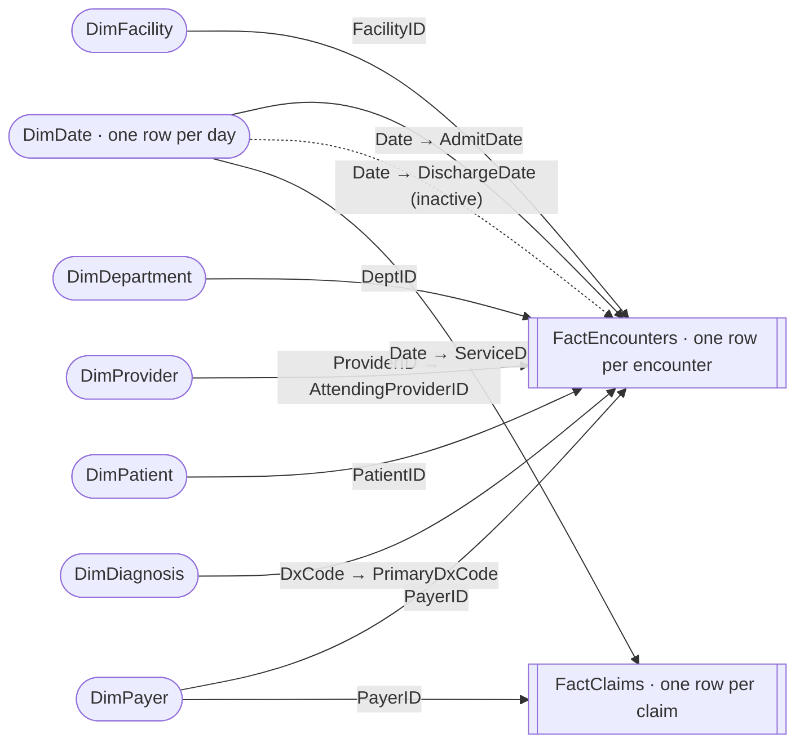

# Lesson 4.4 · Data Model, Power Pivot & DAX

> **Level:** Advanced · **Time:** about 175 minutes · **Workbook:** [`4.4-power-pivot-dax.xlsx`](4.4-power-pivot-dax.xlsx)
> **Data:** A star schema of the whole Bluestone Health System for 2024–2025: every encounter (21,857 rows) and every claim (21,857 rows) as fact tables, plus dimension tables for dates, facilities, departments, providers, patients, payers, and diagnoses. The columns come from [`encounters.csv`](../../data/README.md#encounterscsv), [`claims.csv`](../../data/README.md#claimscsv), and the reference files in the [data dictionary](../../data/README.md).

The CFO asks for charges by facility, the revenue-cycle director asks for denial rates by payer type, and the quality
director asks for readmission rates by age group, all from the same monthly report. Those answers live in different
tables: encounters, claims, patients, payers. Until now you would have pulled every descriptive column into one giant sheet
with XLOOKUP and then built a PivotTable on it. That approach breaks down when the tables have different grains (one claim
per encounter, many encounters per patient), when the sheet passes a million rows, or when the same "denial rate" formula
has to be rebuilt in five places. The **Data Model** keeps each table separate, links them with relationships, and lets you
define every metric once as a **measure** written in **DAX**. It is the same engine that runs Power BI, so what you learn
here carries straight over.

## What you'll learn

- Design a star schema and load tables into the Data Model
- Create relationships and a proper date table
- Write DAX measures with SUM, COUNTROWS, DISTINCTCOUNT, DIVIDE, and CALCULATE
- Use time intelligence (TOTALYTD, SAMEPERIODLASTYEAR) and iterators (SUMX, AVERAGEX)

## 📖 Guide

> 📋 **You need Excel for Windows with Power Pivot** for this lesson: Microsoft 365, Excel 2019 or later, or an edition of
> Excel 2013 or 2016 that includes it (such as Office Professional Plus). Excel for Mac and Excel for the web can't create
> a Data Model, relationships, or measures. If you're on a Mac, read the guide and the answer key, and build the model
> later on a Windows PC, a Windows virtual machine, or a cloud PC. Section 17 has the full version notes.

### 1. Why a Data Model?

Three names come up in this lesson, and they are three different things:

| Term | What it is |
|---|---|
| **Data Model** | An in-memory database stored inside the workbook. It holds tables, relationships between them, and measures |
| **Power Pivot** | The Excel add-in (and its separate window) where you manage the Data Model: load tables, draw relationships, write formulas |
| **DAX** (Data Analysis Expressions) | The formula language of the Data Model. It looks like Excel formulas but works on whole tables and columns instead of cells |

The Data Model stores each column separately and compresses it, so millions of rows fit in a normal workbook. A
PivotTable built on the model can use fields from every table at once.

| | Classic PivotTable | Data Model PivotTable |
|---|---|---|
| Source | One table or range | Many related tables |
| Row limit | 1,048,576 (one worksheet) | Limited only by memory |
| Combining tables | XLOOKUP columns into one flat table first | Relationships, no lookup columns |
| Calculations | Calculated fields (they sum first, then divide) | **Measures** in DAX, reusable everywhere |
| Distinct count | Not available | Built in (Value Field Settings → Distinct Count) |
| Group dates and numbers | Group command | Use columns in a date table or calculated columns |

> 💡 **Tip:** Use a classic PivotTable for a quick look at one table. Reach for the Data Model when a question needs two or
> more tables, when you keep rebuilding the same rate, or when the data is too big for a sheet.

### 2. Star schema: facts and dimensions

A **star schema** organizes tables into two kinds:

- A **fact table** records events: one row per encounter, per claim, per lab result. It holds numbers you add up (charges,
  LOS days) and **keys** that point to the descriptive tables. Fact tables are long and narrow.
- A **dimension table** describes things: one row per facility, payer, patient, or day. Its **key** column is unique, and
  the other columns are the attributes you filter and group by (FacilityName, PayerType, AgeGroup, Quarter). Dimension
  tables are short and wide.

The **grain** of a table is what one row represents. Always know it, because it decides what COUNTROWS counts and what an
average averages. Here is the lesson's model. Arrows show the direction filters travel, from each dimension into the facts.



| Sheet and Excel Table | Role | Grain (one row per…) | Key | Rows |
|---|---|---|---|--:|
| `FactEncounters` | Fact | encounter (visit or stay) | EncounterID | 21,857 |
| `FactClaims` | Fact | claim | ClaimID | 21,857 |
| `DimDate` | Dimension (date table) | calendar day, 1/1/2024–12/31/2025 | Date | 731 |
| `DimFacility` | Dimension | facility | FacilityID | 4 |
| `DimDepartment` | Dimension | department | DeptID | 31 |
| `DimProvider` | Dimension | provider | ProviderID | 147 |
| `DimPatient` | Dimension | registered patient | PatientID | 4,000 |
| `DimPayer` | Dimension | payer | PayerID | 8 |
| `DimDiagnosis` | Dimension | ICD-10-CM code | DxCode | 51 |

Each sheet has the same name as its Excel Table, and the model keeps that name, so DAX reads naturally:
`FactEncounters[TotalCharges]`. A few columns need a definition:

| Column | Meaning |
|---|---|
| `FactEncounters[AdmitDate]`, `[DischargeDate]` | Dates only, with no time of day, so they match `DimDate[Date]` exactly |
| `FactEncounters[LOSDays]` | Discharge date − admit date (midnights). Inpatient stays count at least 1. ED and outpatient visits are mostly 0 |
| `FactEncounters[Readmit30]` | 1 if an inpatient stay was followed by another inpatient admission within 30 days, 0 if not, blank for other encounter types |
| `DimPatient[AgeGroup]` | Age on 12/31/2025 (the course's as-of date): 0-17, 18-44, 45-64, 65-74, 75+ |
| `DimPayer[AvgAllowedPctOfCharges]` | The share of billed charges a payer's contract typically allows (Medicare 31%, for example) |

Four design rules keep a model trustworthy:

1. **Every dimension key is unique.** DimFacility has exactly one row for F03. If it had two, the model couldn't tell which
   one an encounter belongs to.
2. **Facts hold keys and numbers. Descriptions live in dimensions.** FactEncounters stores `PayerID`, not the payer's name
   and type, so a payer renamed tomorrow changes in one row.
3. **Two fact tables share dimensions instead of relating to each other.** FactClaims and FactEncounters both connect to
   DimDate and DimPayer (shared dimensions are called **conformed dimensions**). One PivotTable with PayerType in Rows can
   then show encounter measures and claim measures side by side.
4. **Relate facts straight to each dimension.** Avoid chains such as FactEncounters → DimDepartment → DimFacility (a
   *snowflake*). They work, but they are slower and harder to reason about.

> ⚠️ **Why not one flat table?** Joining claims onto encounters works here because there is exactly one claim per encounter.
> Join something with a different grain, such as lab results (many per encounter), and every encounter row repeats once per
> lab. SUM(TotalCharges) then counts the same charges several times. Keeping each fact table at its own grain, related
> only to dimensions, avoids that double counting.

### 3. Turn on Power Pivot and load the tables

**Turn on the add-in once.** Go to **File → Options → Add-ins**, choose **COM Add-ins** in the *Manage* box at the bottom,
click **Go…**, tick **Microsoft Power Pivot for Excel**, and click **OK**. A **Power Pivot** tab appears on the ribbon.

**Add each table to the model.** There are several ways to do it:

| Method | Steps | Notes |
|---|---|---|
| **Add to Data Model** (use this one) | Click any cell inside an Excel Table, then **Power Pivot → Add to Data Model** | Creates a *linked table*: the model updates when the Excel Table changes |
| PivotTable dialog | **Insert → PivotTable**, then tick **Add this data to the Data Model** | Adds just that one table |
| Power Query | **Close & Load To…** → tick **Add this data to the Data Model** (often with *Only Create Connection*) | Best for large files, because the rows never touch a sheet (Lesson 4.3) |
| Relationships dialog | **Data → Relationships → New…** | Adds both tables when it creates the relationship |

For this lesson:

1. Click any cell in the **FactEncounters** table and choose **Power Pivot → Add to Data Model**. The Power Pivot window
   opens with a FactEncounters tab.
2. Switch back to Excel (click the Excel window, or press **Alt + Tab**), click inside the next table, and repeat until all
   nine tables have a tab in the Power Pivot window.
3. In the Power Pivot window, click a date column such as `FactEncounters[AdmitDate]` and check **Home → Data Type**. It
   should say **Date**. Number columns should say Whole Number or Decimal Number, and IDs Text.

**A tour of the Power Pivot window.** Open it any time with **Power Pivot → Manage** (or **Data → Manage Data Model**).

| Part | What it's for |
|---|---|
| **Data View** (Home → Data View) | One tab per table, showing the rows. Add calculated columns in the rightmost empty column |
| **Calculation area** (Home → Calculation Area) | The grid under the rows. Type measures here as `Name:=formula` |
| **Formula bar** | Shows the formula of the selected column or measure |
| **Diagram View** (Home → Diagram View) | Boxes for tables and lines for relationships. Drag to create relationships |
| **Design tab** | Create Relationship, Manage Relationships, Mark as Date Table, Date Table → New |
| **Home → PivotTable** | Inserts a PivotTable connected to the model |

> ⚠️ Saving the workbook saves the model inside it, and the model is stored in addition to the sheets. Expect the file to
> grow after you load the tables. Save after each big step.

### 4. Relationships

A **relationship** connects a key column in a fact table to the unique key of a dimension table. It is **one-to-many**:
one row in DimFacility (F03) matches many rows in FactEncounters. Excel's relationships filter in **one direction**, from the
"one" side to the "many" side. When a PivotTable cell says *FacilityName = Cedar Ridge Medical Center*, that filter selects
F03 in DimFacility and then travels along the relationship to keep only F03's rows in FactEncounters.

**Create a relationship in Diagram View:**

1. In the Power Pivot window, click **Home → Diagram View**. Drag the table boxes apart so you can see every column name.
2. Drag **FacilityID** in the FactEncounters box onto **FacilityID** in the DimFacility box. A line appears with **1** at
   the DimFacility end and **\*** at the FactEncounters end.
3. Repeat for every row of the table below. The direction you drag doesn't matter, because Power Pivot works out which
   side is unique.

You can also use **Design → Create Relationship** in the Power Pivot window, or **Data → Relationships → New…** in Excel.
The Excel dialog asks for *Table* and *Column (Foreign)*, which is the fact side, and *Related Table* and *Related Column
(Primary)*, which is the dimension side.

The ten relationships for this lesson (they are also on the workbook's **Model Map** sheet):

| # | Many side (fact column) | One side (dimension key) | Active? |
|:-:|---|---|:-:|
| 1 | `FactEncounters[AdmitDate]` | `DimDate[Date]` | Yes |
| 2 | `FactEncounters[DischargeDate]` | `DimDate[Date]` | **No** |
| 3 | `FactEncounters[FacilityID]` | `DimFacility[FacilityID]` | Yes |
| 4 | `FactEncounters[DeptID]` | `DimDepartment[DeptID]` | Yes |
| 5 | `FactEncounters[AttendingProviderID]` | `DimProvider[ProviderID]` | Yes |
| 6 | `FactEncounters[PatientID]` | `DimPatient[PatientID]` | Yes |
| 7 | `FactEncounters[PayerID]` | `DimPayer[PayerID]` | Yes |
| 8 | `FactEncounters[PrimaryDxCode]` | `DimDiagnosis[DxCode]` | Yes |
| 9 | `FactClaims[ServiceDate]` | `DimDate[Date]` | Yes |
| 10 | `FactClaims[PayerID]` | `DimPayer[PayerID]` | Yes |

**Active and inactive relationships.** Only one relationship between the same two tables can be **active**, which means it
is the one filters use by default. FactEncounters has two date columns, so when you create relationship 2, Power Pivot
draws it as a **dashed line** and marks it inactive. That's correct. Every "in 2025" in this lesson dates encounters by
AdmitDate, and section 13 shows how one measure can switch to DischargeDate.

Both columns in a relationship must have the **same data type** (Date with Date, Text with Text), and the dimension side must
be unique. If Power Pivot refuses with a message about **duplicate values**, the column you chose on the one side isn't
unique.

> 💡 **Tip:** Hide the fact table's **foreign keys** (the key columns that point to dimensions) from the field list:
> right-click `FactEncounters[FacilityID]` in Data View or Diagram View → **Hide from Client Tools**. People then slice by `DimFacility[FacilityName]`, which is the column the
> relationships are designed for.

> 📋 Power BI lets you set a relationship to filter in both directions and supports many-to-many relationships. Excel's
> relationship settings offer neither option, so in Excel, filters flow from the dimension to the fact.

### 5. The date table

Time-intelligence functions such as TOTALYTD and SAMEPERIODLASTYEAR work by shifting and extending sets of dates. They need
a **date table** that meets four conditions:

1. One row per day, with **no gaps**. DimDate has all 731 days from 1/1/2024 to 12/31/2025.
2. It covers **whole years**, so "same period last year" always finds a matching day.
3. Its Date column has the **Date** data type and is **unique**.
4. It is **related to the fact tables on a date column**, and it is **marked as the date table**.

DimDate also carries the columns you group by, so you never need Excel's Group command:

| Column | Example | Use |
|---|---|---|
| `Date` | 07/15/2025 | The key. Time-intelligence functions take this column |
| `Year` | 2025 | Rows or filter |
| `Quarter` | Q3 | Rows or filter |
| `MonthNum` | 7 | Sorting only |
| `MonthName` | Jul | Rows, sorted by MonthNum |
| `YearMonth` | 2025-07 | One label per month that sorts correctly as text |
| `DayName` | Tue | Day-of-week patterns |

**Mark DimDate as the date table:** in the Power Pivot window, select the DimDate tab, then **Design → Mark as Date
Table**, choose the **Date** column, and click **OK**.

**Sort the month names in calendar order:** select the `MonthName` column in Data View, then **Home → Sort by Column**, and
sort MonthName by **MonthNum**. Without this, PivotTables list months alphabetically (Apr, Aug, Dec…).

> ⚠️ **Date keys must not contain times.** The source data stores AdmitDateTime values such as 07/15/2025 14:32. A value with
> a time never equals a DimDate row (07/15/2025 00:00), so every encounter would land in a **(blank)** row. That's why
> FactEncounters has AdmitDate and DischargeDate columns with the time removed. When you build your own models, strip the
> time in Power Query (Lesson 4.3) or with a calculated column before relating.

> ⚠️ **Automatic date grouping.** If you drag a date column such as AdmitDate into a PivotTable's Rows, Excel may add
> extra calculated columns such as *AdmitDate (Month)* and *AdmitDate (Quarter)* to that table in the model. Use DimDate's
> own columns instead. To stop the automatic grouping, tick **File →
> Options → Data → Disable automatic grouping of Date/Time columns in PivotTables**.

> 📋 No date table in your data? In the Power Pivot window, **Design → Date Table → New** builds a *Calendar* table that
> spans the dates in your model. Power BI users often create one with `CALENDAR(DATE(2024,1,1), DATE(2025,12,31))` or
> `CALENDARAUTO()`, but Excel's Power Pivot can't create tables from DAX formulas, so in Excel you load a date table or use
> Date Table → New.

### 6. PivotTables from the Data Model

Insert a PivotTable that reads the whole model with either of these:

- In the Power Pivot window: **Home → PivotTable → PivotTable**, then choose **New Worksheet**.
- In Excel (Microsoft 365): **Insert → PivotTable → From Data Model**. In older versions, choose **Insert → PivotTable**
  and then **Use this workbook's Data Model**.

The **PivotTable Fields** pane now lists every table in the model, each with its own columns. Expand **DimFacility** and tick
**FacilityName**, then expand **FactEncounters** and drag **EncounterID** into Values. Excel creates **Count of
EncounterID**. A field dragged into Values like this is an **implicit measure**. Implicit measures are fine for a quick look,
but they have limits:

| | Implicit measure (drag a field to Values) | Explicit measure (written in DAX) |
|---|---|---|
| Created by | Dragging | You, with a name and a formula |
| Reusable in other measures | No | Yes |
| Usable as a KPI's base value | No | Yes |
| Logic | Only SUM, COUNT, AVERAGE, MIN, MAX, DISTINCT COUNT of one column | Anything DAX can express |
| Format | Set in each PivotTable | Set once in the measure |

> 💡 **Tip:** Data Model PivotTables offer **Distinct Count** under Value Field Settings → Summarize Values By. Classic
> PivotTables don't. It's the quickest way to count unique patients.

Data Model PivotTables don't support the calculated fields from Lesson 3.4, and most of the Group command's options aren't
available. Measures replace calculated fields, and columns in the dimension tables (DimDate[Quarter], DimPatient[AgeGroup])
replace grouping.

> ⚠️ **The relationship check.** If a PivotTable shows the **same number in every row**, and the field list says
> *Relationships between tables may be needed*, the table in Rows isn't related to the table in Values. The measure can't
> be split, so every row shows the grand total. Fix the relationship. Don't click Auto-Detect and hope.

### 7. Explicit measures and DAX syntax

A **measure** is a named DAX formula that a PivotTable evaluates once for **every cell**, using that cell's filters. To
create one:

1. Click **Power Pivot → Measures → New Measure…**
2. **Table name:** the table the measure will be listed under in the field list (its *home table*). Choose the fact table
   the measure is about, for example FactEncounters.
3. **Measure name:** `Total Charges`.
4. **Formula:** `=SUM(FactEncounters[TotalCharges])`. Click **Check formula** to catch typos.
5. **Formatting Options:** choose *Currency* with 0 decimal places. For rates, choose *Number → Percentage* with 1 decimal
   place.
6. Click **OK**. The measure appears in the field list with an *fx* icon, ready to drag into Values.

You can also type measures straight into the Power Pivot window's **calculation area**, as `Total Charges:=SUM(FactEncounters[TotalCharges])`,
or right-click a table in the PivotTable Fields pane and choose **Add Measure…**. To edit or rename one later, use **Power
Pivot → Measures → Manage Measures**.

This lesson writes measures as `Name := formula`, the same way the calculation area does:

```dax
Total Charges := SUM(FactEncounters[TotalCharges])
Encounters := COUNTROWS(FactEncounters)
Avg Charge := DIVIDE([Total Charges], [Encounters])
```

To use one of these lines in the Measure dialog, type the part before `:=` in **Measure name**. The **Formula** box already
starts with `=`, so type the part after `:=` right after that equals sign. Lines that start with `--` in the answer key are
notes about the PivotTable layout, so don't type them into a measure.

| DAX syntax | Meaning |
|---|---|
| `FactEncounters[TotalCharges]` | A column: always write the table name in front |
| `[Total Charges]` | A measure: no table name, because measure names are unique in the whole model |
| `'Dim Date'[Date]` | Table names with spaces need single quotes |
| `"Inpatient"` | Text values go in double quotes, as in Excel |
| `&&` and `\|\|` | AND and OR between conditions. (The AND() and OR() functions take only two arguments) |
| `=`, `<>`, `>`, `<=` | Comparisons |
| `-- note` or `// note` | A comment. DAX ignores the rest of the line |

> 💡 **Tip:** IntelliSense helps you type DAX. Type a few letters of a table name and pick the column from the list, or type
> `[` to see your measures. Double-click a suggestion (or press **Tab**) to insert it.

> ⚠️ A measure can't refer to a bare column: `=FactEncounters[TotalCharges]` fails with *A single value for column
> 'TotalCharges' in table 'FactEncounters' cannot be determined*. A measure must aggregate a column (SUM, MAX…) or iterate
> over it (SUMX, section 11), because one cell covers many rows.

### 8. Counting and adding: SUM, COUNTROWS, DISTINCTCOUNT, DIVIDE

| Function | Returns | Example |
|---|---|---|
| `SUM(column)` | Total of a numeric column | `SUM(FactEncounters[TotalCharges])` |
| `AVERAGE(column)`, `MIN`, `MAX` | Mean, smallest, largest. Blanks are skipped | `AVERAGE(FactEncounters[LOSDays])` |
| `COUNTROWS(table)` | Number of rows | `COUNTROWS(FactEncounters)` |
| `COUNT(column)` | Non-blank values in a column | `COUNT(FactEncounters[Readmit30])` counts inpatient stays |
| `DISTINCTCOUNT(column)` | Number of different values | `DISTINCTCOUNT(FactEncounters[PatientID])` |
| `DIVIDE(numerator, denominator [, alternate])` | Numerator ÷ denominator, or blank (or *alternate*) when the denominator is 0 or blank | `DIVIDE([Denied Claims], [Claims])` |

**Worked example: 2024 by facility.** With DimFacility[FacilityName] in Rows, DimDate[Year] = 2024 in Filters, and three
measures in Values (Encounters, Total Charges, and `Patients := DISTINCTCOUNT(FactEncounters[PatientID])`), the PivotTable
shows:

| FacilityName | Encounters | Total Charges | Patients |
|---|--:|--:|--:|
| Ashby Falls Community Hospital | 948 | \$12,966,081 | 550 |
| Bluestone Memorial Hospital | 5,041 | \$76,147,377 | 2,562 |
| Bluestone Outpatient Pavilion | 3,680 | \$4,394,223 | 2,307 |
| Cedar Ridge Medical Center | 1,043 | \$15,312,607 | 607 |
| **Grand Total** | **10,712** | **\$108,820,288** | **3,576** |

Encounters and Total Charges add up down the column. Patients doesn't: the facility rows sum to 6,026, but the grand total
is 3,576. A patient seen at Bluestone Memorial and at the Outpatient Pavilion counts once in each row and once in the total.
The total is right. A measure **recalculates** the grand total from all the rows that the total covers. It never adds up
the cells above it, which is why rates and distinct counts total correctly in DAX.

> 💡 **Tip:** Use DIVIDE for every ratio. DAX's `/` operator never returns #DIV/0!. A number divided by 0 or by a blank
> returns **Infinity**, 0 ÷ 0 returns **NaN**, and the PivotTable shows those words in the cell. DIVIDE returns a blank
> instead (or the *alternate* result you give it), and PivotTables hide rows where every measure is blank.

### 9. Filter context and CALCULATE

The set of filters that applies to one PivotTable cell is its **filter context**. It comes from the cell's row label, its
column label, the Filters area, and any slicers. Take the cell where *Cedar Ridge Medical Center* meets *2024* for the
Encounters measure:

1. Rows: DimFacility[FacilityName] = Cedar Ridge Medical Center selects one row of DimFacility (F03).
2. Columns or Filters: DimDate[Year] = 2024 selects 366 rows of DimDate.
3. Each filter flows along its relationship, so FactEncounters keeps the rows with FacilityID F03 **and** AdmitDate in 2024.
4. COUNTROWS(FactEncounters) counts those rows: 1,043.

**CALCULATE** evaluates an expression in a *modified* filter context:

```dax
CALCULATE(expression, filter1, filter2, ...)
```

```dax
ED Visits := CALCULATE([Encounters], FactEncounters[EncounterType] = "Emergency")
```

In every cell, CALCULATE takes the cell's filters, adds EncounterType = Emergency, and then counts. Three rules explain what
CALCULATE does with its filter arguments:

| Rule | Example | Effect |
|---|---|---|
| A filter on a column **replaces** any existing filter on that same column | `CALCULATE([Encounters], DimFacility[FacilityName] = "Cedar Ridge Medical Center")` | Every facility row shows Cedar Ridge's count, because the row's own facility filter is overwritten |
| Filters on **different** columns combine with AND | `CALCULATE([Encounters], FactEncounters[EncounterType] = "Inpatient", DimPayer[PayerType] = "Commercial")` | Commercial inpatient encounters |
| OR on **one** column goes inside one filter | `FactClaims[ClaimStatus] = "Denied" \|\| FactClaims[ClaimStatus] = "Appealed"` | Either status. In Microsoft 365 you can also write `FactClaims[ClaimStatus] IN {"Denied", "Appealed"}` |

**Removing filters with ALL and REMOVEFILTERS.** To compare a row with a total, remove a filter on purpose:

```dax
% of System ED := DIVIDE([ED Visits], CALCULATE([ED Visits], ALL(DimFacility)))
```

`ALL(DimFacility)` clears every filter that comes from DimFacility, so the denominator counts all facilities. The year filter
stays because it comes from DimDate. In 2024, Cedar Ridge had 575 of the system's 3,747 ED visits, so the measure shows
**15.3%** in its row. `REMOVEFILTERS(DimFacility)` does the same thing and makes the intent clearer to a reader. Excel for
Microsoft 365 recognizes it, but older versions such as Excel 2016 and 2019 don't, so use ALL there. ALL works in every
version. `ALL(DimFacility[FacilityName])` removes the filter on one column only.

**FILTER for conditions a simple filter can't express.** A filter argument such as `FactEncounters[EncounterType] =
"Emergency"` compares one column with fixed values. When the test compares two columns, or uses a measure, use
**FILTER(table, condition)**. FILTER goes through the table one row at a time and keeps the rows where the condition is TRUE.
This measure counts the attending providers with more than 50 inpatient stays in the current context. (`Inpatient Stays` is
`CALCULATE([Encounters], FactEncounters[EncounterType] = "Inpatient")`, built the same way as ED Visits.)

```dax
Busy Attendings := COUNTROWS(FILTER(VALUES(DimProvider[ProviderID]), [Inpatient Stays] > 50))
```

For 2024 it returns **17**. VALUES returns the providers visible in the cell, FILTER evaluates `[Inpatient Stays]` for each
one, and COUNTROWS counts the survivors.

> ⚠️ FILTER over a whole fact table is much slower than a column filter on a large model. Use a plain filter such as
> `FactEncounters[EncounterType] = "Inpatient"` whenever one column against fixed values is enough, and keep FILTER for
> row-by-row comparisons.

### 10. Row context: calculated columns and RELATED

A **calculated column** is a DAX formula that is evaluated once for **each row** of a table and stored in the model, just
like a column you imported. Inside it, DAX knows which row it is on. That awareness is called **row context**.

To add one, open the table in the Power Pivot window's Data View, click the first cell of the **Add Column** column on the
right, type the formula in the formula bar, and press **Enter**. Then double-click the header to rename it.

```dax
=IF(FactEncounters[LOSDays] >= 7, "7+ days", "Under 7 days")
```

Rename it `LOS Band`, and you can put it in Rows or in a slicer. That's the main reason to build a calculated column: you
want to **slice by** the result.

**RELATED** reads a column from the "one" side of a relationship, for the current row:

```dax
=RELATED(DimDiagnosis[ExpectedLOS])
```

Added to FactEncounters, this column shows each encounter's benchmark LOS from its diagnosis row. **RELATEDTABLE** goes the
other way. In DimPatient, `=COUNTROWS(RELATEDTABLE(FactEncounters))` counts each patient's encounters. RELATED needs a
relationship and a row context, so it works in calculated columns and inside iterators (section 11), but not on its own in
a measure.

**Worked example: a flag column.** Case managers review the stays that ran at least twice as long as the benchmark for their
diagnosis. A calculated column flags each one, and a simple measure adds up the flags:

```dax
-- calculated column in FactEncounters, renamed LongStay
=IF(FactEncounters[EncounterType] = "Inpatient" && FactEncounters[LOSDays] >= 2 * RELATED(DimDiagnosis[ExpectedLOS]), 1, 0)

Long Stays := SUM(FactEncounters[LongStay])
```

The `&&` joins the two tests, and RELATED fetches the benchmark from the encounter's own diagnosis row. Task 9 asks a
similar question, but as one measure built with FILTER (section 9), which gives the same kind of count without storing a
column.

| | Calculated column | Measure |
|---|---|---|
| Evaluated | Once per row, when data is loaded or refreshed | For every PivotTable cell, when the PivotTable needs it |
| Stored | Yes, so it uses memory and file size | No |
| Context | Row context (the current row) | Filter context (the cell's filters) |
| Can go in Rows, Columns, slicers | Yes | No |
| Can go in Values | Yes (as an implicit SUM, COUNT…) | Yes |
| Typical use | Categories and flags: LOS Band, AgeGroup, LongStay | Totals, counts, rates, comparisons |

> 💡 **Tip:** If you want to slice by it, make a column. If you want to aggregate it, make a measure. Avoid copying
> dimension attributes into facts with RELATED (such as a PayerType column in FactEncounters). The relationship already lets
> you slice by `DimPayer[PayerType]`.

### 11. Iterators: SUMX, AVERAGEX, and RANKX

An **iterator** is a function that goes through a table row by row, evaluates an expression on each row, and then combines
the results. Functions whose names end in X are iterators:

| Function | What it does with the per-row results |
|---|---|
| `SUMX(table, expression)` | Adds them |
| `AVERAGEX(table, expression)` | Averages them (blank results are skipped) |
| `MINX`, `MAXX`, `COUNTX` | Smallest, largest, count of non-blank |
| `RANKX(table, expression)` | Ranks the current value against them |
| `FILTER(table, condition)` | Keeps the rows where the condition is TRUE (an iterator too) |

**When SUM isn't enough.** Expected reimbursement is charges × the payer's allowed percentage, row by row. Take three
encounters:

| Encounter | TotalCharges | Payer's allowed % | Charges × % |
|---|--:|--:|--:|
| A | 10,000 | 31% (Medicare) | 3,100 |
| B | 2,000 | 55% (Summit Choice PPO) | 1,100 |
| C | 1,000 | 24% (State Medicaid) | 240 |
| **Total** | **13,000** | | **4,440** |

`SUM(charges) × AVERAGE(allowed %)` gives 13,000 × 36.7% = 4,767, which is wrong because it gives the small Commercial
encounter as much weight as the large Medicare one. SUMX multiplies first and adds second:

```dax
SUMX(FactEncounters, FactEncounters[TotalCharges] * RELATED(DimPayer[AvgAllowedPctOfCharges]))
```

SUMX creates a row context on FactEncounters, so RELATED can fetch each row's payer percentage. It only visits the rows that
survive the cell's filters, so the same measure works for any facility, year, or payer type.

**Context transition.** When you put a *measure* inside an iterator, DAX turns the current row into a filter before
evaluating it. This is called **context transition**. It lets you compute "per something" averages:

```dax
Avg Monthly ED Visits := AVERAGEX(VALUES(DimDate[YearMonth]), [ED Visits])
```

VALUES returns the months in the cell (twelve for a year). For each month, [ED Visits] is evaluated with that month as a
filter, and AVERAGEX averages the twelve results. For 2024 the result is 3,747 ÷ 12 = **312.25**. Swap DimDate[YearMonth]
for FactEncounters[PatientID] and you get an average per patient instead (Task 11).

> ⚠️ Decide what one unit of an average is. `AVERAGE(FactEncounters[TotalCharges])` is the average per **encounter**.
> `AVERAGEX(VALUES(FactEncounters[PatientID]), [Total Charges])` is the average per **patient**. Both are correct answers to
> different questions.

**Ranking with RANKX.**

```dax
Provider Rank :=
IF(
    HASONEVALUE(DimProvider[ProviderName]),
    RANKX(ALL(DimProvider[ProviderName]), [Inpatient Stays])
)
```

RANKX evaluates [Inpatient Stays] for every provider name in its first argument, then reports where the current row's value
falls (1 = largest). The first argument needs **ALL**: without it, the table contains only the current row's provider, and
everyone ranks 1. **HASONEVALUE** is TRUE only when the cell shows exactly one provider, so the Grand Total row stays blank
instead of showing a meaningless rank. In 2024, Emma Ramirez (89 stays) ranks 1 and Alan Wallace (88) ranks 2. Tied values
share a rank, and the next rank is skipped.

### 12. Time intelligence

**Time-intelligence** functions change the *dates* in the filter context: to the year so far, to the same period last year,
or to a rolling window. All of them take the date table's Date column.

| Function | Returns the dates… | Typical measure |
|---|---|---|
| `TOTALYTD(expression, DimDate[Date])` | From January 1 to the last date in context, then evaluates | `Charges YTD := TOTALYTD([Total Charges], DimDate[Date])` |
| `TOTALQTD`, `TOTALMTD` | Quarter to date, month to date | `TOTALQTD([Encounters], DimDate[Date])` |
| `DATESYTD(DimDate[Date])` | Year to date, as a filter for CALCULATE | `CALCULATE([Claims], DATESYTD(DimDate[Date]))` |
| `SAMEPERIODLASTYEAR(DimDate[Date])` | The same dates, one year earlier | `CALCULATE([ED Visits], SAMEPERIODLASTYEAR(DimDate[Date]))` |
| `DATEADD(DimDate[Date], n, interval)` | Shifted by n DAY, MONTH, QUARTER, or YEAR (negative = back) | `CALCULATE([ED Visits], DATEADD(DimDate[Date], -1, MONTH))` |
| `DATESINPERIOD(DimDate[Date], date, n, interval)` | A window of n intervals that starts on *date*, or ends on it when n is negative | `DATESINPERIOD(DimDate[Date], MAX(DimDate[Date]), -3, MONTH)` |

The functions that return dates (DATESYTD, SAMEPERIODLASTYEAR, DATEADD, DATESINPERIOD) go inside CALCULATE as filter
arguments, and CALCULATE's first argument can be a measure or any other expression. `MAX(DimDate[Date])` returns the last
date in the cell's filter context: 3/31/2025 in the March 2025 row, 12/31/2025 in the 2025 row. That makes it the usual
anchor for a rolling window that should end with the cell's own period.

**Worked example: year to date.** Ashby Falls Community Hospital, 2025, with DimDate[Year] and DimDate[MonthName] in Rows:

| Month | Total Charges | Charges YTD |
|---|--:|--:|
| Jan 2025 | 1,434,639 | 1,434,639 |
| Feb 2025 | 1,428,030 | 2,862,669 |
| Mar 2025 | 1,754,050 | 4,616,719 |

In the March row, the cell's dates are March 1–31. TOTALYTD replaces them with January 1 through March 31 and evaluates
Total Charges over that range. On the 2025 total row, Charges YTD equals the full year.

**Worked example: year over year.** The pattern is always a "last year" measure plus a percentage change:

```dax
ED Visits LY := CALCULATE([ED Visits], SAMEPERIODLASTYEAR(DimDate[Date]))
ED YoY % := DIVIDE([ED Visits] - [ED Visits LY], [ED Visits LY])
```

For Cedar Ridge in 2025, ED Visits is 577 and ED Visits LY is 575, so ED YoY % is **0.3%**. The 2024 row shows a blank for
ED Visits LY because the data has no 2023, and DIVIDE turns that into a blank rather than Infinity. Put months in Rows and
the same two measures compare each month with the same month last year.

**Why marking the date table matters.** The March 2025 row filters DimDate[Year] = 2025 *and* DimDate[MonthName] = Mar.
When TOTALYTD puts January–March dates into the filter, those other DimDate filters must go away, or MonthName = Mar would
still cut the result back to March. Because DimDate is marked as the date table, a filter on DimDate[Date] inside
CALCULATE automatically removes the other filters on DimDate. If a YTD measure shows the same number as the base measure,
check that DimDate is marked and related on its Date column.

> ⚠️ **Partial periods.** The data ends on 12/31/2025. A YoY comparison is only fair when both periods are complete. If
> your data stopped mid-month, the current month would look like a drop.

### 13. Inactive relationships and USERELATIONSHIP

"Inpatient stays in December" can mean stays **admitted** in December (the active AdmitDate relationship) or stays
**discharged** in December. Finance and quality reports usually count discharges. Keep AdmitDate as the default and switch
relationships inside one measure:

```dax
IP Discharges :=
CALCULATE(
    [Inpatient Stays],
    USERELATIONSHIP(FactEncounters[DischargeDate], DimDate[Date])
)
```

**USERELATIONSHIP** activates the inactive DischargeDate relationship for this calculation only, and the AdmitDate
relationship is ignored while it runs. In 2024, 2,727 inpatient stays were admitted but 2,681 were discharged, because 46 stays
admitted in late December 2024 went home in January 2025. The switch also applies inside every measure that CALCULATE
evaluates, which is why IP Discharges can reuse [Inpatient Stays] without rewriting it. The relationship must already exist
in the model, so create it (dashed) before you use USERELATIONSHIP.

### 14. KPIs

A **KPI** in Power Pivot wraps a measure with a target and a status icon.

1. Create the base measure first, for example Readmission Rate.
2. Click **Power Pivot → KPIs → New KPI…**
3. **KPI base field (value):** Readmission Rate.
4. **Target value:** choose **Absolute value** and type `0.15`, or pick another measure (for example last year's rate).
5. **Status thresholds:** choose the color scheme that runs from green on the left (low values) to red on the right,
   because a lower readmission rate is better. The sliders measure the value as a **percentage of the target**, so drag
   the left slider to 100% and the right slider to 120%. A rate below the 15% target is then green, a rate between 15%
   and 18% is yellow, and anything higher is red.
6. Pick an icon style and click **OK**.

The KPI appears in the PivotTable Fields pane under the measure's home table, with three parts you can tick: **Value**,
**Goal**, and **Status**. The system's 2024 readmission rate was 376 ÷ 2,727 = 13.8%, which is 92% of the 15% target, so
its Status shows the green icon.

### 15. Getting numbers out: GETPIVOTDATA, CUBEVALUE, and CUBEMEMBER

You don't have to retype numbers from a PivotTable.

**GETPIVOTDATA.** Type `=` in a cell and click a value in a Data Model PivotTable. Excel writes a formula such as:

```
=GETPIVOTDATA("[Measures].[Total Charges]",$A$3,"[DimDate].[Year]","[DimDate].[Year].&[2024]")
```

It keeps returning the right number when the PivotTable is rearranged, as long as that value is still visible.

**CUBEVALUE** reads a measure straight from the model, with no PivotTable at all:

```
=CUBEVALUE("ThisWorkbookDataModel", "[Measures].[Total Charges]", "[DimDate].[Year].&[2024]")
```

That formula returns **108,820,288.31**, the 2024 grand total from section 8. `ThisWorkbookDataModel` is the name of the
workbook's own model connection. Each extra argument is a member, written as `[Table].[Column].&[value]`, and they combine
with AND:

```
=CUBEVALUE("ThisWorkbookDataModel", "[Measures].[Encounters]", "[DimFacility].[FacilityName].&[Cedar Ridge Medical Center]", "[DimDate].[Year].&[2024]")
```

That one returns **1,043**, Cedar Ridge's 2024 encounters from section 9.

**CUBEMEMBER** puts a member in a cell, so other formulas can refer to it:
`=CUBEMEMBER("ThisWorkbookDataModel", "[DimPayer].[PayerType].&[Commercial]")` shows *Commercial*, and
`=CUBEVALUE("ThisWorkbookDataModel", "[Measures].[Denial Rate]", B5)` uses the member in B5. To turn a finished PivotTable
into editable CUBE formulas, click it and choose **PivotTable Analyze → OLAP Tools → Convert to Formulas**.

> 💡 **Tip:** CUBE formulas work in the Practice sheet's yellow cells. Once your model has the measure, a CUBEVALUE formula
> in the answer cell turns the Check column green, and it stays correct after a refresh.

> ⚠️ CUBE functions use explicit measures. Write the measure in DAX first, because an implicit measure such as *Count of
> EncounterID* isn't a reliable target. If a CUBE formula shows `#N/A`, check the spelling of every name in square brackets.

### 16. Troubleshooting

| You see | Likely cause | Fix |
|---|---|---|
| The same number in every row, and *Relationships between tables may be needed* | No relationship between the Rows table and the measure's table | Create the relationship (section 4) |
| A **(blank)** row in the PivotTable | Some fact keys have no match in the dimension: a missing code, text versus number, extra spaces, or dates with times | Clean the keys, and relate date-only columns |
| *…contains duplicate values…* when you create a relationship | The column on the one side isn't unique | Check you picked the dimension's key, then remove duplicates |
| Months in alphabetical order | MonthName isn't sorted by MonthNum | **Home → Sort by Column** in Power Pivot |
| A YTD or LY measure equals the base measure, or is blank | DimDate isn't marked, isn't related on Date, or has gaps | Section 5 |
| *A single value for column … cannot be determined* | A measure refers to a bare column | Aggregate it (SUM, MAX) or use an iterator |
| *…either doesn't exist or doesn't have a relationship to any table available in the current context* | RELATED with no relationship, or with no row context | Create the relationship, or use RELATED inside an iterator or calculated column |
| A Grand Total that isn't the sum of the rows | Distinct counts and rates aren't additive | Usually correct. The measure recalculates the total (section 8) |
| USERELATIONSHIP shows an error | The inactive relationship doesn't exist yet | Create it in Diagram View (section 13) |
| A function isn't recognized | An older DAX engine | Use ALL instead of REMOVEFILTERS, and `\|\|` instead of IN |

### 17. Versions and compatibility

| Excel | Data Model, Power Pivot, and DAX |
|---|---|
| Microsoft 365 for Windows | Everything in this lesson. Enable the Power Pivot COM add-in once |
| Excel 2019, 2021, 2024 for Windows | Power Pivot is included. A few newer DAX functions may be missing, so use ALL instead of REMOVEFILTERS if needed |
| Excel 2013 and 2016 for Windows | Power Pivot comes with some editions only (for example Office Professional Plus) |
| Excel for Mac | No Power Pivot. You can't create a Data Model, relationships, or measures |
| Excel for the web | Can display and filter existing Data Model PivotTables, but can't edit the model |
| Power BI Desktop (free, Windows) | The same engine and the same DAX. Everything here transfers, plus calculated tables and two-way filters |

> 💡 **Tip:** Keyboard help on Windows: **Ctrl + T** turns a range into an Excel Table before you add it to the model (Mac:
> **⌘ + T**), **Alt + F5** refreshes the selected PivotTable, **Ctrl + Alt + F5** refreshes everything, and **Alt + Tab**
> switches between Excel and the Power Pivot window.

## 🧪 Hands-on practice

Download [`4.4-power-pivot-dax.xlsx`](4.4-power-pivot-dax.xlsx) and open the **Model Map** sheet first. Build the model
(sections 3–5), then work through the **Practice** sheet: create each measure, read its value from a Data Model PivotTable,
and type it in the yellow cell. The **Check** column turns green when you're right.

<!-- BEGIN GENERATED: practice -->
Start by building the model (Guide sections 3–5): add all nine tables to the Data Model, create the ten relationships on the Model Map sheet, and mark DimDate as the date table. Task 1 checks that the model works. For every other task, create the measure, show it in a PivotTable built from the Data Model, and type the number the PivotTable shows into the yellow cell (or link to it, as Guide section 15 shows). "In 2025" means DimDate[Year] = 2025 through the active relationships, so encounters are dated by AdmitDate and claims by ServiceDate. "ED visits" means encounters with EncounterType = Emergency.

| # | Task | Hint |
|:-:|------|------|
| 1 | Load all nine tables into the Data Model and create the relationships listed on the Model Map sheet. Then insert a PivotTable from the Data Model with DimFacility[FacilityName] in Rows and FactEncounters[EncounterID] in Values (Excel names it Count of EncounterID). How many encounters (2024 and 2025 together) does Cedar Ridge Medical Center show? | If every facility shows the same number, a relationship is missing |
| 2 | Create the measure Total Charges = the sum of FactEncounters[TotalCharges]. Show it in a PivotTable with DimDate[Year] in Rows. What are the total charges for 2025? Enter the amount rounded to the nearest dollar. | Power Pivot → Measures → New Measure…, then SUM |
| 3 | Create the measure Encounters = the number of rows in FactEncounters. How many encounters did the Emergency Department at Cedar Ridge Medical Center have in Q3 2025? Filter DimFacility[FacilityName] = Cedar Ridge Medical Center, DimDepartment[DeptName] = Emergency Department, DimDate[Year] = 2025, and DimDate[Quarter] = Q3. | COUNTROWS counts the rows of a table |
| 4 | Create the measure Patients = the number of distinct PatientID values in FactEncounters. How many different patients had at least one encounter in 2025, system-wide? (Use the Grand Total, not a sum of facility rows.) | DISTINCTCOUNT |
| 5 | Create the measure Avg LOS (IP) = the average of FactEncounters[LOSDays] for Inpatient encounters only, using CALCULATE so that the measure applies the filter itself. What is it for Bluestone Memorial Hospital in 2025? Enter it to 2 decimal places. | CALCULATE(expression, Table[Column] = "value") |
| 6 | FactClaims shares DimDate and DimPayer with FactEncounters. Create Claims (rows of FactClaims), Denied Claims (claims whose ClaimStatus is Denied or Appealed, because an appealed claim was denied first), and Denial Rate = Denied Claims ÷ Claims, using DIVIDE. What is the denial rate for DimPayer[PayerType] = Medicare Advantage in 2025? Enter it as a percentage with 1 decimal place. | Two conditions on the same column can be joined with \|\| inside CALCULATE |
| 7 | Create Inpatient Stays = Encounters for EncounterType = Inpatient (build it on your Encounters measure), and Readmission Rate = the sum of FactEncounters[Readmit30] ÷ Inpatient Stays. What is the readmission rate for inpatient stays billed to the payer named Medicare (DimPayer[PayerName]) in 2025? Enter it as a percentage with 1 decimal place. | A measure can use another measure: CALCULATE([Encounters], …) |
| 8 | Create ED Visits = Encounters for EncounterType = Emergency, and % of System ED = ED Visits ÷ ED Visits with every DimFacility filter removed. In a PivotTable with DimFacility[FacilityName] in Rows and DimDate[Year] = 2025, what share of the system's ED visits did Ashby Falls Community Hospital handle? Enter it as a percentage with 1 decimal place. | CALCULATE([ED Visits], ALL(DimFacility)), or REMOVEFILTERS(DimFacility) in Microsoft 365 |
| 9 | Create Stays Over Expected = the number of Inpatient encounters whose LOSDays is greater than the ExpectedLOS of their primary diagnosis in DimDiagnosis. Use FILTER over FactEncounters and RELATED. How many inpatient stays at Cedar Ridge Medical Center in 2025 ran longer than expected? | COUNTROWS(FILTER(FactEncounters, test1 && test2)). Inside FILTER, RELATED can read the diagnosis row |
| 10 | Expected reimbursement: create Expected Allowed = the sum, row by row, of FactEncounters[TotalCharges] × the payer's AvgAllowedPctOfCharges from DimPayer. Use SUMX and RELATED. What is Expected Allowed for Bluestone Memorial Hospital in 2025? Enter it rounded to the nearest dollar. | SUMX(table, expression evaluated on each row) |
| 11 | Create Avg Charges per Patient = the average, over the patients in the current filter context, of each patient's Total Charges. Use AVERAGEX over VALUES(FactEncounters[PatientID]) with your Total Charges measure. What is it for patients in DimPatient[AgeGroup] = 75+ in 2025? Enter it rounded to the nearest dollar. | AVERAGEX(VALUES(…), [Total Charges]) |
| 12 | Create Charges YTD = Total Charges accumulated from January 1 to the last date in the current filter context, using TOTALYTD and DimDate[Date]. Put DimDate[Year] and DimDate[MonthName] in Rows and DimFacility[FacilityName] = Bluestone Outpatient Pavilion in Filters. What does Charges YTD show for September 2025? Enter it rounded to the nearest dollar. | TOTALYTD(expression, DimDate[Date]) |
| 13 | Create ED Visits LY = ED Visits for the same period one year earlier (SAMEPERIODLASTYEAR) and ED YoY % = (ED Visits − ED Visits LY) ÷ ED Visits LY. What is the year-over-year change in ED visits at Bluestone Memorial Hospital for 2025 compared with 2024? Put DimDate[Year] in Rows and DimFacility[FacilityName] = Bluestone Memorial Hospital in Filters. Enter it as a percentage with 1 decimal place (negative if visits fell). | CALCULATE([ED Visits], SAMEPERIODLASTYEAR(DimDate[Date])) |
<!-- END GENERATED: practice -->

## ✅ Answer key

The workbook has a hidden **Answer Key** sheet (right-click any sheet tab → **Unhide…**). Column D shows the DAX for each
task. Column E holds a worksheet formula (COUNTIFS, SUMIFS, SUMPRODUCT, XLOOKUP) that recomputes the same answer from the
same tables without the Data Model, which is a good way to see that each PivotTable filter is just a criterion. A few of
those formulas use XLOOKUP, LET, UNIQUE, or FILTER, so Excel 2019 and earlier show #NAME? in those cells, but column C
still holds the answer. The same answers are below, collapsed so you don't see them by accident.

<!-- BEGIN GENERATED: answers -->
<details>
<summary><b>🔑 Show the answer key</b> — Try every task before opening this.</summary>

**1. Relationship check: Cedar Ridge encounters**

- **Answer:** 2,125
- **Solution:**

1. Click any cell in the FactEncounters table, then **Power Pivot → Add to Data Model**. Repeat for the other eight tables.
2. In the Power Pivot window, click **Home → Diagram View**. Drag **FactEncounters[FacilityID]** onto **DimFacility[FacilityID]**, and create the other relationships on the Model Map the same way.
3. Click **Home → PivotTable → PivotTable**, choose **New Worksheet**, and click OK.
4. Tick **DimFacility → FacilityName** so it goes to Rows. Then drag **FactEncounters → EncounterID** into the **Values** area. (Ticking a text field such as EncounterID would put it in Rows instead.)
5. Read the Cedar Ridge Medical Center row. The Grand Total is 21,857.


The facility names live in DimFacility and the encounters live in FactEncounters. The PivotTable can split the count by facility only because the relationship carries each facility's filter from DimFacility[FacilityID] to the matching rows of FactEncounters. Without it, every row shows the grand total (21,857) and the field list displays *Relationships between tables may be needed*. Dragging a field into Values creates an **implicit measure** (Count of EncounterID). It works, but you can't reuse it in other formulas, so from Task 2 on you write explicit measures.

**2. Total Charges, 2025**

- **Answer:** 113,681,796
- **Solution:**

```dax
Total Charges := SUM(FactEncounters[TotalCharges])
-- PivotTable: DimDate[Year] in Rows, [Total Charges] in Values
```


A **measure** is a named formula that the PivotTable evaluates once for every cell. In the 2025 row, the filter Year = 2025 travels from DimDate to FactEncounters through the AdmitDate relationship, so SUM adds only the 2025 rows. The same measure gives the 2024 row and the grand total without any change. Set the measure's format to Currency in the Measure dialog so every PivotTable that uses it shows dollars.

**3. Cedar Ridge ED encounters, Q3 2025**

- **Answer:** 144
- **Solution:**

```dax
Encounters := COUNTROWS(FactEncounters)
-- PivotTable: DimDate[Year] and DimDate[Quarter] in Rows,
--   DimFacility[FacilityName] and DimDepartment[DeptName] in Filters (or slicers)
```


COUNTROWS(FactEncounters) counts whatever rows survive the filters on the cell. Here four filters arrive from three different dimension tables, and each one narrows FactEncounters through its own relationship. Filtering on DeptName alone would count the Emergency Departments of all three hospitals together, because the name repeats, so the FacilityName filter is what isolates Cedar Ridge. COUNTROWS is the usual way to count a fact table, because it doesn't depend on any column being filled in.

**4. Distinct patients, 2025**

- **Answer:** 3,538
- **Solution:**

```dax
Patients := DISTINCTCOUNT(FactEncounters[PatientID])
-- PivotTable: DimDate[Year] in Rows (2025 row), optionally DimFacility[FacilityName] in Columns
```


In 2025 there were 11,145 encounters but only 3,538 different patients, because many patients came back. DISTINCTCOUNT counts each PatientID once in the current filter context. Distinct counts are **not additive**: if you put facilities in Columns, the facility values add up to 6,028, which is more than the 3,538 in the Grand Total, because a patient seen at two facilities counts once per facility but only once system-wide. A measure recomputes the total from the rows. It never adds up the visible cells.

**5. Average inpatient LOS, Bluestone Memorial, 2025**

- **Answer:** 4.68
- **Solution:**

```dax
Avg LOS (IP) :=
CALCULATE(
    AVERAGE(FactEncounters[LOSDays]),
    FactEncounters[EncounterType] = "Inpatient"
)
-- PivotTable: DimFacility[FacilityName] in Rows, DimDate[Year] = 2025 in Filters
```


CALCULATE evaluates its first argument after adding the filters you list. The PivotTable supplies the facility and the year, and CALCULATE adds EncounterType = Inpatient, so the average covers only inpatient stays at Bluestone Memorial in 2025. Without the filter, the same cell also averages ED visits and observation stays (most ED visits have 0 LOS days) and drops to 2.03. Building the filter into the measure means nobody has to remember to set an EncounterType slicer.

**6. Denial rate, Medicare Advantage, 2025**

- **Answer:** 13.6%
- **Solution:**

```dax
Claims := COUNTROWS(FactClaims)
Denied Claims :=
CALCULATE(
    [Claims],
    FactClaims[ClaimStatus] = "Denied" || FactClaims[ClaimStatus] = "Appealed"
)
Denial Rate := DIVIDE([Denied Claims], [Claims])
-- PivotTable: DimPayer[PayerType] in Rows, DimDate[Year] = 2025 in Filters
```


The PayerType filter reaches FactClaims through FactClaims[PayerID] and the year reaches it through ServiceDate. Those are the claims table's own relationships to the shared (conformed) dimensions, so one PivotTable can show encounter measures and claim measures side by side. The || operator means OR, and because both conditions test the same column, CALCULATE accepts it as a single filter. In Microsoft 365 you can also write FactClaims[ClaimStatus] IN {"Denied", "Appealed"}. DIVIDE returns a blank whenever the denominator is 0 or blank, where the / operator would return Infinity or NaN (DAX never shows #DIV/0!). Counting only the Denied status would give 10.2%.

**7. Readmission rate, Medicare, 2025**

- **Answer:** 17.3%
- **Solution:**

```dax
Inpatient Stays := CALCULATE([Encounters], FactEncounters[EncounterType] = "Inpatient")
Readmissions := SUM(FactEncounters[Readmit30])
Readmission Rate := DIVIDE([Readmissions], [Inpatient Stays])
-- PivotTable: DimPayer[PayerName] in Rows, DimDate[Year] = 2025 in Filters
```


Readmit30 holds 1 or 0 on inpatient rows and is blank on every other row, so SUM counts the readmitted stays. The denominator must count inpatient stays only, which is why Inpatient Stays wraps Encounters in CALCULATE. Building measures on measures keeps each definition in one place: if the definition of an inpatient stay ever changes, you fix one measure and every rate that uses it updates. Medicare's readmission rate matters because CMS reduces payments to hospitals with excess readmissions.

**8. Ashby Falls share of system ED visits, 2025**

- **Answer:** 13.5%
- **Solution:**

```dax
ED Visits := CALCULATE([Encounters], FactEncounters[EncounterType] = "Emergency")
% of System ED :=
DIVIDE(
    [ED Visits],
    CALCULATE([ED Visits], ALL(DimFacility))
)
-- Microsoft 365 can also use REMOVEFILTERS(DimFacility) in place of ALL(DimFacility)
-- PivotTable: DimFacility[FacilityName] in Rows, DimDate[Year] = 2025 in Filters
```


In the Ashby Falls row, the numerator sees two filters: the facility and the year. The denominator uses ALL(DimFacility) to clear the facility filter but keeps the year, so it returns all 2025 ED visits in the system. REMOVEFILTERS(DimFacility) does the same job and reads more clearly, but only Excel for Microsoft 365 recognizes it. ALL works in every version. This is the DAX version of Show Values As → % of Column Total, with one big advantage: it's a real measure that you can reuse in other measures, KPIs, and CUBEVALUE formulas. It only works when the PivotTable filters facilities through DimFacility. A filter on FactEncounters[FacilityID] would survive ALL(DimFacility).

**9. Cedar Ridge stays over expected LOS, 2025**

- **Answer:** 229
- **Solution:**

```dax
Stays Over Expected :=
COUNTROWS(
    FILTER(
        FactEncounters,
        FactEncounters[EncounterType] = "Inpatient"
            && FactEncounters[LOSDays] > RELATED(DimDiagnosis[ExpectedLOS])
    )
)
-- PivotTable: DimFacility[FacilityName] in Rows, DimDate[Year] = 2025 in Filters
```


This condition compares a column in the fact table with a column in a dimension table, row by row. A simple CALCULATE filter can't do that, because it tests one column against fixed values. FILTER walks through every FactEncounters row visible in the cell (Cedar Ridge, 2025) and keeps the rows where the test is TRUE. Because FILTER works one row at a time (a **row context**), RELATED can follow that row's relationship to DimDiagnosis and fetch its ExpectedLOS. 229 of Cedar Ridge's 408 inpatient stays in 2025 ran long. The calculated-column route from Guide section 10 gives the same count: flag each stay with IF(… > RELATED(DimDiagnosis[ExpectedLOS]), 1, 0) and SUM the flag. The FILTER measure needs no stored column.

**10. Expected Allowed (SUMX), Bluestone Memorial, 2025**

- **Answer:** 29,782,218
- **Solution:**

```dax
Expected Allowed :=
SUMX(
    FactEncounters,
    FactEncounters[TotalCharges] * RELATED(DimPayer[AvgAllowedPctOfCharges])
)
-- PivotTable: DimFacility[FacilityName] in Rows, DimDate[Year] = 2025 in Filters
```


Each payer pays a different share of charges, so you must multiply on every row before you add. SUM(TotalCharges) × AVERAGE(AvgAllowedPctOfCharges) would weight every payer equally and give the wrong answer. SUMX is an **iterator**: it evaluates the expression once per visible row (here, Bluestone Memorial's 2025 encounters) and then adds the results. RELATED fetches each encounter's payer percentage through the PayerID relationship. The result works out to 37.9% of charges, the blended rate that finance uses to estimate net revenue before the claims are paid.

**11. Avg charges per patient (AVERAGEX), 75+, 2025**

- **Answer:** 43,815
- **Solution:**

```dax
Avg Charges per Patient :=
AVERAGEX(
    VALUES(FactEncounters[PatientID]),
    [Total Charges]
)
-- PivotTable: DimPatient[AgeGroup] in Rows, DimDate[Year] = 2025 in Filters
```


VALUES returns the list of distinct patients visible in the cell (aged 75+, with 2025 encounters). AVERAGEX evaluates [Total Charges] once for each patient and averages the results. Calling a measure inside an iterator triggers **context transition**: the current patient becomes a filter, so [Total Charges] returns that one patient's charges. The result is the same as DIVIDE([Total Charges], [Patients]), and it is a different question from AVERAGE(TotalCharges), which averages per encounter (12,632 here). Always decide what one unit of the average is: an encounter, a patient, or a month.

**12. Charges YTD at September 2025, Outpatient Pavilion**

- **Answer:** 3,609,114
- **Solution:**

```dax
Charges YTD := TOTALYTD([Total Charges], DimDate[Date])
-- PivotTable: DimDate[Year], DimDate[MonthName] in Rows, DimFacility[FacilityName] in Filters
```


In the September 2025 row, the filter context holds the dates September 1 to September 30, 2025. TOTALYTD replaces them with every date from January 1 through September 30, 2025 and evaluates Total Charges over that range. September on its own was 353,672. Time-intelligence functions need a proper date table: one row per day with no gaps, marked as the date table, and related to the fact table on a date column. If MonthName sorts alphabetically (Apr, Aug, Dec…), set Sort by Column to MonthNum in Power Pivot.

**13. ED visits YoY %, Bluestone Memorial, 2025 vs 2024**

- **Answer:** 1.7%
- **Solution:**

```dax
ED Visits LY := CALCULATE([ED Visits], SAMEPERIODLASTYEAR(DimDate[Date]))
ED YoY % := DIVIDE([ED Visits] - [ED Visits LY], [ED Visits LY])
-- PivotTable: DimDate[Year] in Rows, DimFacility[FacilityName] in Filters
```


In the 2025 row, SAMEPERIODLASTYEAR shifts the year's dates back one year, so ED Visits LY returns the 2024 count (2,642) next to the 2025 count (2,687). The 2024 row has no prior year in the data, so its LY value is blank and DIVIDE returns a blank. The / operator would show Infinity there. The same measures work by quarter or by month without any change, because they shift whatever dates the cell contains. CALCULATE([ED Visits], DATEADD(DimDate[Date], -1, YEAR)) gives the same result.

</details>
<!-- END GENERATED: answers -->

## 🏆 Bonus challenge

<!-- BEGIN GENERATED: bonus -->
The Chief Medical Officer wants a one-page December 2025 briefing built from the Data Model, so that next month it refreshes instead of being rebuilt. It needs a rolling ED trend, a same-month comparison for the smallest hospital, the busiest inpatient attending, discharges counted by discharge date, and a readmission rate dated the way quality teams date it. Use your measures from the practice tasks and add new ones as needed. ED visits are encounters with EncounterType = Emergency.

Work on the **Bonus** sheet of the workbook.

- **B1.** Create ED Visits 3M Avg = the average monthly ED visits over the three months ending with the last date in the current filter context (use DATESINPERIOD). What does it show for December 2025, system-wide? Enter it to 1 decimal place. *(Hint: DATESINPERIOD(DimDate[Date], MAX(DimDate[Date]), -3, MONTH))*
- **B2.** Ashby Falls Community Hospital: what is the percentage change in ED visits for December 2025 compared with December 2024? Enter it as a percentage with 1 decimal place (negative if visits fell). *(Hint: Your ED YoY % measure from Task 13 works at month level too)*
- **B3.** Create Provider Rank = the rank of each attending provider by Inpatient Stays (1 = most stays), using RANKX over ALL(DimProvider[ProviderName]) and returning a blank on the Grand Total row. With DimProvider[ProviderName] in Rows and DimDate[Year] = 2025, which provider is ranked 1? Enter the name exactly as it appears in DimProvider[ProviderName]. *(Hint: RANKX(ALL(…), [measure]) ranks against every provider. HASONEVALUE is TRUE only on a single-provider row)*
- **B4.** The briefing must count inpatient discharges by discharge date, not admit date. Create IP Discharges = Inpatient Stays evaluated through the inactive relationship FactEncounters[DischargeDate] → DimDate[Date]. How many inpatient discharges did the system have in December 2025? *(Hint: USERELATIONSHIP(many-side column, one-side column) goes inside CALCULATE as a filter argument)*
- **B5.** Quality reports date each inpatient stay by its discharge, because the 30-day readmission window starts at discharge. Create Readmission Rate (Disch) = your Readmission Rate measure from Task 7, evaluated through the inactive DischargeDate relationship. What is the system's readmission rate for inpatient stays discharged in Q3 2025, the latest quarter whose 30-day windows are complete? Enter it as a percentage with 1 decimal place. *(Hint: You don't need to rebuild the ratio. CALCULATE changes the context for every measure inside it)*
<!-- END GENERATED: bonus -->

<!-- BEGIN GENERATED: bonus-answers -->
<details>
<summary><b>🔑 Show the bonus solution</b> — Give it a real try first!</summary>

**B1. Rolling 3-month average ED visits, Dec 2025**

- **Answer:** 326.7
- **Solution:**

```dax
ED Visits 3M Avg :=
CALCULATE(
    AVERAGEX(VALUES(DimDate[YearMonth]), [ED Visits]),
    DATESINPERIOD(DimDate[Date], MAX(DimDate[Date]), -3, MONTH)
)
-- PivotTable: DimDate[Year], DimDate[MonthName] in Rows
```


In the December 2025 row, MAX(DimDate[Date]) is 12/31/2025, and DATESINPERIOD returns the three months of dates ending there (October 1 to December 31). CALCULATE swaps those dates in for December's, then AVERAGEX evaluates ED Visits once per month (another context transition) and averages 294, 321, and 365. Dividing the three-month total by 3 gives the same number here, but AVERAGEX is more honest at the start of the data: in January 2024 there is only one month to average, and /3 would understate it.

**B2. Ashby Falls ED visits, Dec 2025 vs Dec 2024**

- **Answer:** -32.9%
- **Solution:**

```dax
-- Reuse Task 13's measures in a month-level PivotTable:
ED Visits LY := CALCULATE([ED Visits], SAMEPERIODLASTYEAR(DimDate[Date]))
ED YoY % := DIVIDE([ED Visits] - [ED Visits LY], [ED Visits LY])
-- PivotTable: DimDate[Year], DimDate[MonthName] in Rows, FacilityName = Ashby Falls in Filters
```


Ashby Falls had 47 ED visits in December 2025 against 70 in December 2024. You don't need a new measure: in the December 2025 cell, SAMEPERIODLASTYEAR shifts December 2025's dates to December 2024. This is the payoff of measures. You define the logic once, and it adapts to whatever year, month, or facility the cell represents. Small hospitals have small monthly counts, so a large percentage swing can come from a difference of a couple of dozen visits. Show the counts next to the percentage in the briefing.

**B3. Top inpatient attending (RANKX), 2025**

- **Answer:** Juan Price
- **Solution:**

```dax
Provider Rank :=
IF(
    HASONEVALUE(DimProvider[ProviderName]),
    RANKX(ALL(DimProvider[ProviderName]), [Inpatient Stays])
)
-- PivotTable: DimProvider[ProviderName] in Rows, DimDate[Year] = 2025 in Filters
```


RANKX is an iterator. ALL(DimProvider[ProviderName]) gives it every provider name, even though the current row shows just one, and RANKX evaluates [Inpatient Stays] for each name through context transition. It then reports where the current row's value falls in that list. Without ALL, the list would contain only the current provider and every row would rank 1. HASONEVALUE blanks the Grand Total, where a rank means nothing. Juan Price attended 91 inpatient stays in 2025, and second place had 84.

**B4. Inpatient discharges, Dec 2025 (USERELATIONSHIP)**

- **Answer:** 310
- **Solution:**

```dax
IP Discharges :=
CALCULATE(
    [Inpatient Stays],
    USERELATIONSHIP(FactEncounters[DischargeDate], DimDate[Date])
)
-- PivotTable: DimDate[Year], DimDate[MonthName] in Rows
```


Only one relationship between two tables can be active, so the DischargeDate relationship is inactive (a dashed line in Diagram View) and normally does nothing. USERELATIONSHIP switches it on for this one calculation, so the December 2025 filter from DimDate now selects stays that were discharged in December. In the same row, Inpatient Stays shows 268 admissions and IP Discharges shows 310. The difference is the 42 stays admitted before December and discharged in December. All 268 December admissions in this extract went home by 12/31. In a live system, some December admissions would still be in the hospital at midnight on 12/31, which would pull the two numbers apart the other way. If the inactive relationship doesn't exist in your model, USERELATIONSHIP returns an error, so create it first (see the Model Map).

**B5. Readmission rate by discharge date, Q3 2025**

- **Answer:** 13.2%
- **Solution:**

```dax
Readmission Rate (Disch) :=
CALCULATE(
    [Readmission Rate],
    USERELATIONSHIP(FactEncounters[DischargeDate], DimDate[Date])
)
-- PivotTable: DimDate[Year], DimDate[Quarter] in Rows
```


CALCULATE switches to the DischargeDate relationship before it evaluates [Readmission Rate], and the switch carries into every measure that rate uses. Both the numerator ([Readmissions]) and the denominator ([Inpatient Stays]) therefore count stays discharged in Q3: 83 readmissions out of 627 discharges. Dated by admission, the same quarter shows 13.0%, so forgetting the relationship gives a close but wrong number. To see why the briefing uses Q3, add DimDate[MonthName] to Rows: December 2025 drops to 7.4%. A stay discharged on December 20 has a 30-day window that runs past the end of the data, so its readmission can't appear yet. Report readmissions only for periods whose follow-up window has closed.

</details>
<!-- END GENERATED: bonus-answers -->

## Key takeaways

- A **star schema** keeps facts (events with keys and numbers) separate from dimensions (one row per thing, unique key).
  Relate each fact straight to its dimensions, and let two facts share dimensions instead of relating them to each other.
- Relationships carry filters from the dimension (one side) to the fact (many side). Same number in every row means a
  relationship is missing. A **(blank)** row means keys that don't match.
- A proper **date table** has one row per day with no gaps, whole years, a Date-type key, and is **marked as the date
  table**. Relate it on date-only columns.
- **Measures** are evaluated per PivotTable cell in that cell's **filter context**. Calculated columns are evaluated per row
  and stored. Slice by columns, aggregate with measures.
- **CALCULATE** changes the filter context: it adds or replaces filters, ALL and REMOVEFILTERS remove them, and
  USERELATIONSHIP switches to an inactive relationship. Use DIVIDE for every ratio.
- **Iterators** (SUMX, AVERAGEX, FILTER, RANKX) work row by row. Use them when each row needs its own calculation before
  the totals, and remember that a measure inside an iterator triggers context transition.
- **Time intelligence** (TOTALYTD, SAMEPERIODLASTYEAR, DATEADD, DATESINPERIOD) shifts the dates in the filter context, so one
  measure answers the question for any year, quarter, or month.

<!-- BEGIN GENERATED: nav -->
---

⬅️ **Previous:** [4.3 Power Query: Import, Transform & Combine](../03-power-query/README.md) · 🏠 [Course home](../../README.md) · **Next:** [4.5 Statistics & Forecasting](../05-statistics-forecasting/README.md) ➡️
<!-- END GENERATED: nav -->
