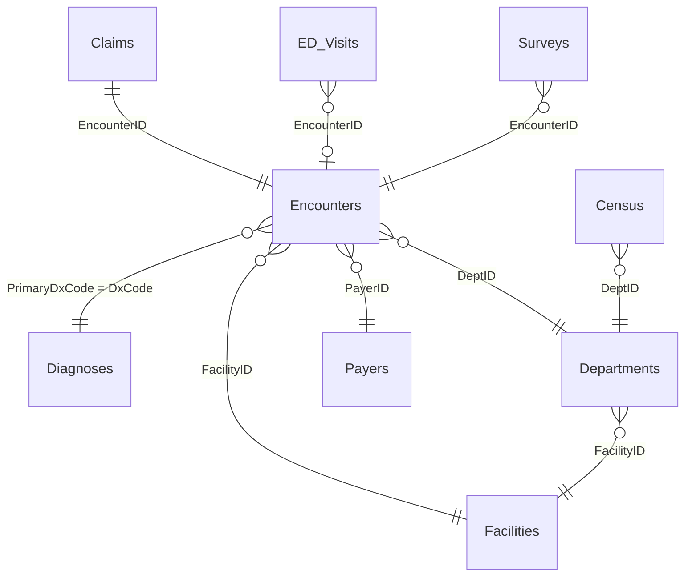

# Lesson 6.1 · Capstone: Hospital Performance Review

> **Level:** Expert · **Time:** about 180 minutes · **Workbook:** [`6.1-hospital-performance-review.xlsx`](6.1-hospital-performance-review.xlsx)
> **Data:** Bluestone Health System, 2025: 11,196 encounters discharged in 2025 and their 11,196 claims, 6,217 ED arrivals, 987 patient-experience survey rows (including a duplicated batch), 6,570 unit-days of census, and the Facilities, Departments, Diagnoses, and Payers lookup tables.

Every January, a hospital's leaders ask the same question in a dozen forms: *how did we do last year?* The Chief Medical
Officer wants to know whether care was safe and efficient. The Chief Financial Officer wants to know whether the hospital
was paid for it. The board wants one page it can read in five minutes. Answering well takes more than formulas. You have
to turn vague questions into exact definitions, combine data from several systems, check that the numbers are right, and
present them so that busy people act on them. In this capstone you'll do the whole job for Bluestone Health System. You'll
start from a brief, prepare nine tables of 2025 data, compute the KPIs a board actually reads, and deliver a dashboard, a
one-click refresh macro, and an executive summary. You won't meet any new functions. The challenge is choosing the right
tool from Lessons 1.1–5.5 and getting every definition exactly right.

## What you'll learn

- Plan an analysis from business questions to deliverables
- Prepare multi-table data (cleaning, joins, calculated fields)
- Analyze throughput, quality, utilization, and finance KPIs
- Deliver a dashboard, an automated refresh macro, and an executive summary

## 📖 Guide

### 1. The brief

This is the request that starts the project. The workbook's **Brief** sheet holds the same text and the metric
definitions, so you can keep it open next to your work.

| Item | Detail |
|---|---|
| **From** | Dr. Priya Raman, Chief Medical Officer, and Marcus Hale, Chief Financial Officer (both fictional) |
| **To** | You, Senior Analyst, Performance Improvement |
| **Ask** | Before the January board retreat, give us an honest, numbers-first review of 2025 across our three hospitals: Bluestone Memorial (F01), Ashby Falls Community (F02), and Cedar Ridge (F03). |
| **Scope** | Encounters discharged in 2025 and their claims, ED arrivals in 2025, surveys for 2025 discharges, and the 2025 unit census. Data as of 12/31/2025. |
| **Deliverables** | (a) A one-page **dashboard** with a hospital selector, system totals, targets, and status. (b) A one-click **refresh macro** so the review can be rerun every month. (c) A one-page **executive summary** with a headline, 3–5 findings, 2–3 recommendations, and caveats. |

The leaders asked five questions. Each one maps to a domain of hospital performance and to one or more
**KPIs** (key performance indicators), the few numbers that answer a question at a glance.

| # | Question | Domain | KPIs | Data |
|:-:|---|---|---|---|
| 1 | Are patients moving through our EDs and units efficiently? | **Throughput** | Median door-to-provider minutes, LWBS %, ALOS | ED_Visits, Encounters |
| 2 | Is our care safe and effective? | **Quality** | O/E LOS index, 30-day readmission rate | Encounters, Diagnoses, Departments |
| 3 | Do patients rate us well? | **Experience** | HCAHPS top-box % | Surveys |
| 4 | Are we using our beds well? | **Utilization** | Inpatient occupancy %, ICU occupancy % | Census, Departments |
| 5 | Are we getting paid for the care we deliver? | **Finance** | Denial rate, net collection rate | Claims |

### 2. Plan the analysis before you write a formula

Analysts who start typing formulas straight away usually rebuild their work twice. Ten minutes of planning saves an
hour, because every later step depends on two decisions: *exactly* what each number means, and what the reader will see.

Build a **metric map**: one row per KPI that links the business question to its definition, its data, and where it will
appear. Here's one row, filled in:

| Question | KPI | Numerator | Denominator (population) | Source columns | Shown on |
|---|---|---|---|---|---|
| Do patients come back? | 30-day readmission rate | Index stays with Readmit30 = Y | Inpatient stays discharged Jan 1 – Nov 30, 2025, not Expired | Encounters C, D, G, I, L | Dashboard row 14; summary finding |

Writing the denominator out in words forces the questions that change the answer. Which stays count? Which dates? What
about patients who died? Section 5 lists the agreed definitions for every KPI in this review.

Then follow a **work plan**. Each phase produces something you can check before you move on.

| Phase | What you do | Practice tasks | Time | Review |
|---|---|:-:|:-:|---|
| 1. Plan | Read the brief, write the metric map, sketch the dashboard | — | 15 min | 4.6 |
| 2. Prepare | Remove duplicates, add calculated and lookup columns, check row counts | 1, 2 (and the columns in 7, 8) | 35 min | 2.3, 2.6, 3.1, 3.3 |
| 3. Compute | Calculate every KPI for the system and for each hospital | 3–10 | 50 min | 2.4, 2.5, 3.4, 4.2 |
| 4. Dashboard | Make the Dashboard sheet selector-driven, add status and a chart | 11 | 40 min | 3.2, 3.5, 4.6 |
| 5. Automate | Write and run the RefreshReview macro | 12 | 20 min | 5.1–5.5 |
| 6. Summarize | Write the executive summary with linked numbers | 13 | 20 min | 2.2 |

You may use any tool from the course. Each one has strengths in this project:

| Tool | Good for here | Watch out for |
|---|---|---|
| **Formulas** (COUNTIFS, SUMIFS, XLOOKUP, LET) | Exact KPI cells, selector-driven dashboard cards, sentences that update | Long formulas are hard to audit. Name steps with LET (4.2) |
| **PivotTables** (3.4) | Fast exploration, ranking groups such as service lines, averages of 1/0 flags | No median. They don't refresh until you click **Refresh** |
| **Power Query** (4.3) | Repeatable cleaning (remove duplicates, merges) when next month's extract arrives | Full editor on Windows. The Mac editor has fewer connectors |
| **Data Model and DAX** (4.4) | Measures across related tables without lookup columns | Building the model needs Excel for Windows |
| **VBA** (5.1–5.5) | The one-click refresh, the audit log, PDF export | Needs an .xlsm file and desktop Excel. Not available in Excel for the web |

> 💡 **Tip:** Agree on the definitions with whoever asked the question *before* you present numbers. "Readmission rate"
> without a definition invites a debate about the definition instead of a discussion about patients.

### 3. The data: nine tables and how they connect

The workbook holds two kinds of table. A **fact table** records events, one row per thing that happened, such as an
encounter, a claim, or an ED arrival. A **lookup table** (a *dimension* in Lesson 4.4) describes the things those events
refer to, such as a diagnosis or a department. Every analysis in this capstone joins facts to lookups through a **key**,
a column whose value identifies one row of the lookup table.

| Sheet (Excel Table) | One row per | Rows | Key | Links to |
|---|---|--:|---|---|
| **Encounters** (`tblEncounters`) | encounter discharged in 2025 | 11,196 | EncounterID | Diagnoses, Departments, Facilities, Payers |
| **Claims** (`tblClaims`) | claim (exactly one per encounter) | 11,196 | ClaimID | Encounters (EncounterID), Payers |
| **ED_Visits** (`tblED`) | ED arrival in 2025 | 6,217 | EDVisitID | Encounters (EncounterID), Facilities |
| **Surveys** (`tblSurveys`) | returned survey, plus a duplicated batch | 987 | SurveyID | Encounters, Facilities, Departments |
| **Census** (`tblCensus`) | inpatient unit per day in 2025 | 6,570 | CensusDate + DeptID | Departments, Facilities |
| **Facilities** (`tblFacilities`) | hospital or site | 4 | FacilityID | |
| **Departments** (`tblDepartments`) | unit or clinic | 31 | DeptID | Facilities |
| **Diagnoses** (`tblDiagnoses`) | ICD-10 code, with its benchmark **ExpectedLOS** | 51 | DxCode | |
| **Payers** (`tblPayers`) | insurer | 8 | PayerID | |



Each fact table is filtered to 2025 by **one** date, and the choice matters. Encounters and Claims use the discharge
(service) date, so a stay that began on 12/16/2024 and ended on 01/01/2025 is a 2025 stay. That's row 2 of Encounters,
a 16.20-day sepsis stay. ED_Visits uses the arrival time, Surveys the patient's discharge date, and Census the calendar
day.

Formulas in this lesson use plain cell ranges such as `Encounters!D2:D11197`, so you need the column letters. The empty
helper columns you fill have yellow headers in the workbook and appear in bold below. The
[data dictionary](../../data/README.md) explains every column and code.

| Sheet | Columns |
|---|---|
| Encounters | A EncounterID · B PatientID · C EncounterType · D FacilityID · E DeptID · F AdmitDateTime · G DischargeDateTime · H PrimaryDxCode · I DischargeDisposition · J PayerID · K TotalCharges · L Readmit30 · **M LOSDays** · **N ExpectedLOS** · **O ServiceLine** |
| ED_Visits | A EDVisitID · B EncounterID · C FacilityID · D ArrivalDateTime · E ProviderSeenDateTime · F DepartureDateTime · G ESILevel · H ArrivalMode · I EDDisposition · **J DoorToProviderMin** |
| Claims | A ClaimID · B EncounterID · C PayerID · D ServiceDate · E BilledAmount · F AllowedAmount · G PatientResponsibility · H PaidAmount · I ClaimStatus · J DenialReason |
| Surveys | A SurveyID · B EncounterID · C FacilityID · D DeptID · E DischargeDate · F SurveyReceivedDate · G–K five 1–4 items (nurse, doctor, staff responsiveness, cleanliness, quietness) · L OverallRating (0–10) · M WouldRecommend |
| Census | A CensusDate · B FacilityID · C DeptID · D StaffedBeds · E Admissions · F Discharges · G MidnightCensus · **H UnitType** |
| Facilities | A FacilityID · B FacilityName · C City · D FacilityType · E LicensedBeds |
| Departments | A DeptID · B DeptName · C FacilityID · D ServiceLine · E UnitType · F StaffedBeds |
| Diagnoses | A DxCode · B DxDescription · C DxCategory · D ExpectedLOS |
| Payers | A PayerID · B PayerName · C PayerType |

> 💡 **Tip:** Every data sheet is an Excel Table, so you can also write structured references such as
> `tblEncounters[FacilityID]` (Lesson 3.1). They're longer to type but keep working when next month's extract has more
> rows. Plain ranges are used here only because they're easier to compare with the answer key.

### 4. Prepare the data

Preparation is where most real-world errors start, so work in a fixed order and check as you go.

1. **Keep the raw data raw.** Fix only what the brief tells you to fix (the duplicate surveys), and add your work in new
   columns or on new sheets. Then every number traces back to an untouched source.
2. **Profile** each table: count rows, look for blanks and duplicates, and check date ranges.
3. **Clean** what's wrong, and write down what you changed.
4. **Enrich** the facts with calculated columns and lookup columns.
5. **Validate**: reconcile counts and spot-check a few rows by hand.

#### 4.1 Profile before you trust

These quick checks take a minute and catch most extract problems:

| Check | Formula | Result here | What it tells you |
|---|---|--:|---|
| Rows in Encounters | `=ROWS(Encounters!A2:A11197)` | 11,196 | Should equal Claims rows, because every encounter has one claim |
| Claims with no matching encounter | `=SUM(--ISNA(XMATCH(Claims!B2:B11197,Encounters!A2:A11197)))` | 0 | Every claim joins to an encounter (referential integrity) |
| ED arrivals with no provider time | `=COUNTBLANK(ED_Visits!E2:E6218)` | 100 | These are the LWBS patients. Exclude them from waiting-time medians |
| Earliest admission | `=MIN(Encounters!F2:F11197)`, formatted as a date and time | 12/16/2024 12:06 | Stays that started in 2024 are included, by design |
| Duplicate survey rows | `=ROWS(Surveys!A2:A988)-ROWS(UNIQUE(Surveys!A2:A988))` | (task 1) | Anything above 0 means some SurveyIDs appear more than once |

XMATCH and UNIQUE need Microsoft 365 or Excel 2021+. In older versions, use
`=SUMPRODUCT(--(COUNTIF(Encounters!A2:A11197,Claims!B2:B11197)=0))` for the join check, which is slower but works.

#### 4.2 Remove duplicate rows

The survey vendor re-sent one month's file, so a block of rows at the bottom of Surveys repeats earlier rows exactly.
Counting them twice would give that month's patients double weight in the top-box score.

1. Click any cell inside the Surveys table.
2. Choose **Data → Remove Duplicates**. The same command is on **Table Design** (Mac: **Table**) as **Remove
   Duplicates**.
3. Leave **My data has headers** ticked. Leave every column ticked to remove rows that match in *every* column, or tick
   only **SurveyID** to treat any repeated ID as a duplicate. Both give the same result here because the copies are
   exact.
4. Click **OK**. Excel reports how many duplicate values it removed and how many unique values remain. Write those two
   numbers in your cleaning notes.

Excel keeps the **first** occurrence of each row and deletes the later ones.

> ⚠️ Remove Duplicates deletes rows for good. Press **Ctrl + Z** (Mac: **⌘ + Z**) straight away if the result looks
> wrong, and save a copy of the workbook before you start. To look before you delete, select the SurveyID column and
> choose **Home → Conditional Formatting → Highlight Cells Rules → Duplicate Values**. It highlights *both* copies of
> each duplicate.

Two non-destructive alternatives: `=UNIQUE(Surveys!A2:M988)` spills a de-duplicated copy of the whole table (Microsoft
365 or Excel 2021+), and Power Query's **Home → Remove Rows → Remove Duplicates** step repeats the clean-up every time you
refresh (Lesson 4.3).

#### 4.3 Calculated columns

A **calculated column** adds a value to every row from that row's own data. Excel stores a date-time as a day number with
the time as a fraction, so subtracting two date-times gives a duration in days.

| Column | First-row formula | Plain-English meaning | Row 2 result |
|---|---|---|--:|
| Encounters **M** LOSDays | `=G2-F2` | discharge minus admission, in days | 16.20 |
| ED_Visits **J** DoorToProviderMin | `=IF(E2="","",ROUND((E2-D2)*1440,0))` | provider time minus arrival, in whole minutes, blank when the patient was never seen | 15 |

Type the formula in the first row and press **Enter**. The Table fills the whole column, and Excel may rewrite it as
`=[@DischargeDateTime]-[@AdmitDateTime]`. That's the same formula in structured-reference form.

To add a helper column of your own, type its header in the first empty column to the right of the Table, such as P1 on
Encounters. The Table grows to include the new column (Lesson 3.1), and a formula typed in P2 fills down the same way.

> ⚠️ When you subtract two date-times, Excel sometimes gives the result a date format, so 3.36 days appears as
> *01/03/1900 08:38*. The value is right. Select the column and press **Ctrl + Shift + ~** (Mac: **Control + Shift + ~**)
> for General, or **Ctrl + 1** (Mac: **⌘ + 1**) → **Number** with 2 decimals.

> 📋 Minutes are `days × 1440` because a day has 24 × 60 = 1,440 minutes. Date-time arithmetic produces tiny
> floating-point errors, so 39 minutes can come out as 38.99999999. ROUND in the helper column removes them. A
> MEDIAN without ROUND still matches the answer key, because the checks allow for this.

#### 4.4 Joins with XLOOKUP

A **join** brings a column from a lookup table into a fact table by matching keys. Three joins prepare everything this
review needs:

```
=XLOOKUP(lookup_value, lookup_array, return_array, [if_not_found])
```

| New column | Key in the fact table | Lookup table | First-row formula |
|---|---|---|---|
| Encounters **N** ExpectedLOS | H PrimaryDxCode | Diagnoses (A → D) | `=XLOOKUP(H2,Diagnoses!$A$2:$A$52,Diagnoses!$D$2:$D$52)` |
| Encounters **O** ServiceLine | E DeptID | Departments (A → D) | `=XLOOKUP(E2,Departments!$A$2:$A$32,Departments!$D$2:$D$32)` |
| Census **H** UnitType | C DeptID | Departments (A → E) | `=XLOOKUP(C2,Departments!$A$2:$A$32,Departments!$E$2:$E$32)` |

The `$` signs lock the lookup ranges so they don't slide down as the formula fills the column (Lesson 1.5).

| Version | Use instead of XLOOKUP |
|---|---|
| Microsoft 365, Excel 2021 or later | XLOOKUP as above |
| Excel 2019 or earlier | `=INDEX(Diagnoses!$D$2:$D$52,MATCH(H2,Diagnoses!$A$2:$A$52,0))` or `=VLOOKUP(H2,Diagnoses!$A$2:$D$52,4,FALSE)` |
| Power Query | **Home → Merge Queries**, Left Outer join on the key, then expand the column (4.3) |
| Data Model | A relationship in Diagram View, with no lookup column at all (4.4) |

> ⚠️ **A blank result becomes 0.** Outpatient diagnoses such as E11.9 (type 2 diabetes) have no ExpectedLOS, and XLOOKUP
> returns 0 for them, not a blank. The `if_not_found` argument doesn't help, because the code *was* found. Every 2025
> inpatient diagnosis has a benchmark, so the O/E index is safe. Still, add the pair `Encounters!N2:N11197,">0"` to the
> numerator's SUMIFS so the definition "stays that have a benchmark" holds even when the data changes.

> ⚠️ **#N/A means a key is missing.** If a lookup column shows #N/A, the fact table holds a code the lookup table lacks.
> Don't hide it with IFERROR. Find out why, because a missing benchmark or department silently drops stays from a KPI.

#### 4.5 Validate your preparation

Check each new column before you build on it:

- `=COUNTIFS(Encounters!C2:C11197,"Inpatient",Encounters!N2:N11197,0)` returns **0**, so every inpatient stay found a
  benchmark.
- `=COUNTIF(Census!H2:H6571,"Critical Care")/365` returns **3**, the three ICUs, each with 365 days.
- Spot-check one row by hand. Row 2 of Encounters is PrimaryDxCode A41.9 (sepsis), and Diagnoses shows its ExpectedLOS
  is 5.0, so N2 must be 5.0.

### 5. The metric definitions

These are the agreed definitions. They're also on the **Brief** sheet. Use them exactly, because the Practice checks
expect them.

| Domain | KPI | Numerator | Denominator / population | Notes |
|---|---|---|---|---|
| Throughput | **ALOS** (average length of stay) | Sum of LOSDays | Count of Inpatient encounters | LOSDays = discharge − admission in decimal days |
| Throughput | **Median door-to-provider** | Median of (ProviderSeenDateTime − ArrivalDateTime) × 1440 | ED arrivals that have a ProviderSeenDateTime | A median, not an average, because waits are skewed |
| Throughput | **LWBS %** | ED arrivals with EDDisposition = LWBS | All ED arrivals | LWBS = left without being seen |
| Quality | **O/E LOS index** | Sum of LOSDays | Sum of ExpectedLOS | Inpatient stays with a benchmark. 1.00 = at benchmark |
| Quality | **30-day readmission rate** | Index stays with Readmit30 = Y | **Index stays**: Inpatient, discharged Jan 1 – Nov 30, 2025, DischargeDisposition not Expired | December is left out because its 30-day window runs past the data |
| Experience | **HCAHPS top-box %** | Surveys with OverallRating 9 or 10 | All surveys, after removing duplicates | *Top box* = the best answers on the scale |
| Utilization | **Occupancy %** | Sum of MidnightCensus | Sum of StaffedBeds | Inpatient occupancy uses Inpatient and Critical Care units. ICU occupancy uses Critical Care units |
| Finance | **Denial rate** | Claims with ClaimStatus Denied or Appealed | **Adjudicated claims**: every claim except Pending | An appealed claim was denied first |
| Finance | **Net collection rate** | Sum of PaidAmount | Sum of AllowedAmount | Adjudicated claims only |

Small choices in a definition move the result. Here's the *system-wide* readmission rate under three choices:

| Population | Index stays | Readmissions | Rate |
|---|--:|--:|--:|
| Inpatient, discharged Jan 1 – Nov 30, not Expired (**the definition**) | 2,543 | 410 | **16.1%** |
| Inpatient, all of 2025, not Expired | 2,849 | 433 | 15.2% |
| December discharges only | 306 | 23 | 7.5% |

December looks excellent only because its patients haven't had 30 days to come back. A report that included December
would show a false improvement, so the definition leaves it out until January's data arrives.

### 6. Formula patterns for the KPIs

Most KPIs in this review come from five patterns. Each worked example below uses a slice that isn't a Practice task, so
you can follow along and then apply the same pattern yourself.

#### 6.1 A rate is COUNTIFS ÷ COUNTIFS

Write the denominator first, then copy it and add one more condition for the numerator. Two formulas with the same
conditions can't drift apart.

**Worked example:** the 30-day readmission rate at Ashby Falls (F02).

```
=COUNTIFS(Encounters!C2:C11197,"Inpatient",Encounters!D2:D11197,"F02",
          Encounters!G2:G11197,"<"&DATE(2025,12,1),Encounters!I2:I11197,"<>Expired",
          Encounters!L2:L11197,"Y")
 /COUNTIFS(Encounters!C2:C11197,"Inpatient",Encounters!D2:D11197,"F02",
          Encounters!G2:G11197,"<"&DATE(2025,12,1),Encounters!I2:I11197,"<>Expired")
```

The result is 58 ÷ 323 = **18.0%**. LWBS % follows the same pattern:
`=COUNTIF(ED_Visits!I2:I6218,"LWBS")/COUNTA(ED_Visits!A2:A6218)` gives 100 ÷ 6,217 = **1.6%** for the system.

To count several values of one column, give COUNTIF an **array constant** and add the results. Patients who left before
treatment was finished are LWBS plus Left AMA:
`=SUM(COUNTIF(ED_Visits!I2:I6218,{"LWBS","Left AMA"}))/COUNTA(ED_Visits!A2:A6218)` gives 146 ÷ 6,217 = **2.3%**.

#### 6.2 Date-time windows

DischargeDateTime holds a date *and* a time, and `DATE(2025,11,30)` means midnight at the start of November 30. So the
end of a window needs `<` the next day:

| Criteria | Includes a discharge at 11/30/2025 14:00? | Use it? |
|---|:-:|:-:|
| `"<="&DATE(2025,11,30)` | No, because 14:00 is later than 00:00 | ❌ |
| `"<"&DATE(2025,12,1)` | Yes | ✅ |
| `"<=11/30/2025"` | No, and the text date also depends on regional settings | ❌ |

Start dates work the other way round: `">="&DATE(2025,7,1)` includes everything from midnight on July 1.

#### 6.3 Ratios of totals: O/E, occupancy, ALOS

O/E, occupancy, and ALOS are all **a total divided by a total**. Add up the numerator over the whole population, add up the
denominator, then divide once.

**Worked example:** the system's O/E LOS index. All 2,905 inpatient stays add up to 13,605.0 observed days, and their
benchmarks add up to 10,827.2 expected days.

```
=SUMIFS(Encounters!M2:M11197,Encounters!C2:C11197,"Inpatient",Encounters!N2:N11197,">0")
 /SUMIFS(Encounters!N2:N11197,Encounters!C2:C11197,"Inpatient")
```

13,605.0 ÷ 10,827.2 = **1.257**, so across the system patients stay about 26% longer than the benchmark predicts for
their diagnoses.

**Worked example:** the 2025 occupancy of Medical-Surgical 4 West (D110). Add a second DeptID in an array constant to
pool units, as in `{"D110","D111"}` for both Bluestone Memorial med-surg units (88.3%).

```
=SUMIFS(Census!G2:G6571,Census!C2:C6571,"D110")/SUMIFS(Census!D2:D6571,Census!C2:C6571,"D110")      → 90.0%
=SUM(SUMIFS(Census!G2:G6571,Census!C2:C6571,{"D110","D111"}))
 /SUM(SUMIFS(Census!D2:D6571,Census!C2:C6571,{"D110","D111"}))                                      → 88.3%
```

> ⚠️ **Don't average ratios.** The average of each day's occupancy, or of each stay's own O/E, gives small units and
> short stays the same weight as large ones. Total ÷ total weights every bed-day and every patient-day equally. The same
> rule appears in Lesson 1.4 for a single unit.

#### 6.4 Medians with conditions

Excel has AVERAGEIFS but no MEDIANIFS. Put an IF *inside* MEDIAN instead: the IF returns the value on rows that pass and
FALSE on the others, and MEDIAN ignores FALSE.

```
=MEDIAN(IF(condition, values))
```

**Worked example:** the system's median door-to-provider time.

```
=MEDIAN(IF(ED_Visits!E2:E6218<>"",(ED_Visits!E2:E6218-ED_Visits!D2:D6218)*1440))
```

The result is **38 minutes**. The *average* is 47.6 minutes, because a few very long waits pull it up. That's why waiting
times are reported as medians. Add a second condition by multiplying, as in `(ED_Visits!C2:C6218="F01")*(ED_Visits!E2:E6218<>"")`.

| Excel version | How to enter MEDIAN(IF()) |
|---|---|
| Microsoft 365, Excel 2021 or later | Press **Enter** |
| Excel 2019 or earlier | Press **Ctrl + Shift + Enter** (Mac: **⌘ + Shift + Return**) so Excel treats it as an array formula |
| Excel 2010 or later (Mac: 2011 or later), without array entry | `=AGGREGATE(17,6,(E2:E6218-D2:D6218)*1440/((C2:C6218="F01")*(E2:E6218<>"")),2)` on the ED_Visits sheet. Function 17 is QUARTILE.INC, quartile 2 is the median, and option 6 ignores the #DIV/0! errors that the division creates on excluded rows |

If you filled the DoorToProviderMin helper column, `=MEDIAN(IF(ED_Visits!C2:C6218="F01",ED_Visits!J2:J6218))` works
too, because MEDIAN also ignores the "" text on LWBS rows.

> ⚠️ A PivotTable can't show a median. Its **Summarize Values By** list has Average but no Median. In the Data Model, DAX
> has a MEDIAN function (Lesson 4.4).

#### 6.5 Which group is highest?

Questions such as "which service line has the highest readmission rate" need a rate *per group* and then the top group.
There are three good routes:

| Route | How | Best when |
|---|---|---|
| **PivotTable** | Add a 1/0 helper flag, then Rows = group and Values = Average of the flag. Sort largest to smallest | You want to explore and see every group |
| **Summary table** | List the groups, add COUNTIFS for the denominator and numerator, divide, then `INDEX(groups,MATCH(MAX(rates),rates,0))` | The answer must update with formulas, in any Excel version |
| **One formula** | LET + UNIQUE + COUNTIFS + XLOOKUP(MAX(…)) | Microsoft 365, and you're comfortable with Lesson 4.2 |

The **average of a 1/0 flag is a rate**. If ReadmitFlag is 1 for a readmission and 0 otherwise, its average over index
stays is the readmission rate. That's how a PivotTable computes rates (Lesson 3.4). For the PivotTable route on
Encounters, add two helper columns. The double minus turns TRUE and FALSE into 1 and 0 (Lesson 2.1).

| Helper column | Row 2 formula | 1 means |
|---|---|---|
| **IndexStay** | `=--AND(C2="Inpatient",G2<DATE(2025,12,1),I2<>"Expired")` | The stay meets the index-stay definition |
| **ReadmitFlag** | `=--(L2="Y")` | The patient was readmitted within 30 days |

Then insert a PivotTable from `tblEncounters`, put IndexStay in **Filters** and pick 1, put the group in **Rows**, and put
ReadmitFlag in **Values** summarized by **Average**. Format the values as a percentage.

**Worked example:** which payer has the largest share of its 2025 claims still Pending? On a new sheet:

1. In A2, type `=Payers!A2` and fill down to A9 to list the eight PayerIDs.
2. In B2, count all claims: `=COUNTIF(Claims!$C$2:$C$11197,A2)`.
3. In C2, count pending claims: `=COUNTIFS(Claims!$C$2:$C$11197,A2,Claims!$I$2:$I$11197,"Pending")`.
4. In D2, divide: `=C2/B2`. Fill B2:D2 down to row 9.
5. Find the top payer: `=XLOOKUP(INDEX(A2:A9,MATCH(MAX(D2:D9),D2:D9,0)),Payers!A2:A9,Payers!B2:B9)`.

The answer is **Self-Pay**, with 296 of 589 claims (50.3%) still pending. Patients paying for themselves pay slowly, which
is a finding the CFO will want to see.

#### 6.6 Where Power Query and DAX fit

If you're comfortable with Lessons 4.3 and 4.4, you can build the same review as a model instead of with lookup columns:

- In **Power Query**, load each sheet with **Data → From Table/Range**, remove the duplicate surveys with **Remove
  Duplicates**, and merge Diagnoses and Departments into Encounters. Next month you replace the source and click
  **Refresh All**.
- In the **Data Model**, relate the tables and write measures. The readmission measure, for example:

```dax
Readmission Rate :=
VAR IndexStays =
    CALCULATE ( COUNTROWS ( tblEncounters ),
        tblEncounters[EncounterType] = "Inpatient",
        tblEncounters[DischargeDateTime] < DATE ( 2025, 12, 1 ),
        tblEncounters[DischargeDisposition] <> "Expired" )
VAR Readmits =
    CALCULATE ( COUNTROWS ( tblEncounters ),
        tblEncounters[EncounterType] = "Inpatient",
        tblEncounters[DischargeDateTime] < DATE ( 2025, 12, 1 ),
        tblEncounters[DischargeDisposition] <> "Expired",
        tblEncounters[Readmit30] = "Y" )
RETURN DIVIDE ( Readmits, IndexStays )
```

A PivotTable from the model then shows the rate by hospital or service line without any helper column. The Practice
answers are the same whichever route you take.

### 7. Build the dashboard

The **Dashboard** sheet is your template. It's laid out the way an executive reads, top to bottom. The hidden
**Reference Dashboard** sheet has a finished version to compare against (right-click a sheet tab → **Unhide…**).

| Cells | What goes there |
|---|---|
| C4 | The **selector**: a drop-down list of the three hospitals (already set up with **Data → Data Validation → List**, source `=Facilities!$B$2:$B$4`) |
| C5 | Your formula: the FacilityID of the hospital in C4 |
| D8:D19 | The selected hospital's value for each KPI |
| E8:E19 | The system value (all three hospitals) |
| F8:G19 | The targets and the goal direction (≤ means lower is better). Blue type marks inputs you may change |
| H8:H19 | Your status formula: Met or Missed. The green and red formatting is already applied |
| H2 | The refresh time, which your macro writes |

#### 7.1 Make every card selector-driven

A **selector-driven formula** refers to the selector cell instead of a typed value, so one set of formulas serves every
hospital. First turn the name into an ID:

```
C5:  =XLOOKUP(C4,Facilities!B2:B5,Facilities!A2:A5)
```

Then write each card with `$C$5` wherever you would have typed "F01". A few patterns:

| KPI | Selected hospital (column D) | System (column E) |
|---|---|---|
| ED visits | `=COUNTIF(ED_Visits!$C$2:$C$6218,$C$5)` | `=COUNTA(ED_Visits!$A$2:$A$6218)` |
| ALOS | `=AVERAGEIFS(Encounters!$M$2:$M$11197,Encounters!$D$2:$D$11197,$C$5,Encounters!$C$2:$C$11197,"Inpatient")` | the same AVERAGEIFS without the FacilityID pair |
| Readmission rate | section 6.1's formula with `$C$5` in place of `"F02"` | the same COUNTIFS ÷ COUNTIFS without the FacilityID pair |

The finance rows are system-wide, because Claims has no FacilityID column, so put the same formula in D and E.

> 💡 **Tip:** Test a selector-driven dashboard by switching C4 between all three hospitals. Any card that doesn't change
> still contains a typed ID. A card that shows #N/A has a lookup that found nothing, and #DIV/0! means a denominator
> condition matched no rows.

#### 7.2 Status against target

The Goal column tells one formula which direction is good:

```
H9:  =IF(D9="","",IF(G9="≤",IF(D9<=F9,"Met","Missed"),IF(D9>=F9,"Met","Missed")))
```

The outer IF leaves the status blank until the card has a value. Without it, an empty card counts as 0, and 0 is
below every "≤" target, so the row would show Met. Copy the formula to every row that has a goal. Conditional formatting (Lesson 3.2) colors Met green and Missed red. To change the
colors, select H8:H19 and choose **Home → Conditional Formatting → Manage Rules**.

#### 7.3 Add a chart

Build a small table that lists each hospital's O/E index or readmission rate, select it, and insert a **Clustered
Column** chart from **Insert → Charts** (Lesson 3.5). Follow three rules:

- Start bar and column axes at **zero**. If the axis starts at 1.22, an O/E of 1.28 draws a bar almost twice as tall
  as an O/E of 1.25, although the two differ by about 2%. Set the minimum in **Format Axis → Bounds → Minimum**.
- Write the message in the title, for example "Every hospital runs above the LOS benchmark".
- Use one color, and use a second color only for the bar you want the reader to notice.

#### 7.4 Finish and share

1. Delete the build notes under the KPI table. The Dashboard already hides gridlines. On any sheet you add for
   readers, clear **View → Gridlines** so the page reads as a report.
2. Lock everything except the selector and the refresh time. Select C4, hold **Ctrl** (Mac: **⌘**) and click H2, press
   **Ctrl + 1** (Mac: **⌘ + 1**), and on the **Protection** tab clear **Locked**. Then choose **Review → Protect Sheet**.
   H2 must stay unlocked because your macro writes to it, and a macro can't write to a locked cell on a protected sheet.
3. Fit the page: **Page Layout → Orientation → Landscape**, then set **Width** to *1 page* in the **Scale to Fit**
   group. The **Page Setup** dialog does the same with **Fit to 1 page wide**. Open it from the small arrow in the corner
   of the **Scale to Fit** group (Windows) or with **File → Page Setup** (Mac).
4. Export: **File → Export → Create PDF/XPS** (Mac: **File → Save As → PDF**), or let your macro do it (section 8).

### 8. Automate the refresh with a macro

Next month the extracts will be replaced and the review rerun. A **refresh macro** turns that into one click and leaves an
**audit row**, a record of what was loaded and when, so you can prove the dashboard reflects complete data.

#### 8.1 Set up and run

1. Save your workbook as **Excel Macro-Enabled Workbook (\*.xlsm)** with **File → Save As**. An .xlsx file can't keep
   code.
2. Press **Alt + F11** (Mac: **Option + F11**, or **Developer → Visual Basic**) to open the Visual Basic Editor.
3. Choose **File → Import File…** and import [`starter/RefreshReview_Starter.bas`](starter/RefreshReview_Starter.bas). It
   becomes a module called **modRefresh**.
4. Write the code for the five comments marked `STEP 1` to `STEP 5`. The helper functions `DataRowCount` and
   `LogSheet` are already written.
5. Choose **Debug → Compile VBAProject** to catch typing errors before you run anything.
6. Back in Excel, press **Alt + F8** (Mac: **Option + F8**), select **RefreshReview**, and click **Run**.
7. Optional: add a button. Choose **Developer → Insert → Button (Form Control)** (Mac: **Developer → Button**), draw it
   on the Dashboard, and pick RefreshReview in the **Assign Macro** box.

The finished module is in [`solutions/RefreshReview_Solution.bas`](solutions/RefreshReview_Solution.bas). It's a spoiler,
so try the starter first. If you import the solution as well, remove the starter module first, because both are named
modRefresh.

#### 8.2 What the macro does

| Step | Code | Why |
|---|---|---|
| Remember settings | `oldCalc = Application.Calculation` and `ScreenUpdating = False` | Faster, and the cleanup block restores the user's settings |
| Refresh | `ThisWorkbook.RefreshAll`, then `Application.CalculateUntilAsyncQueriesDone` | Reloads Power Query queries and PivotTables, and waits for background queries to finish |
| Clean | `Range("A1").CurrentRegion.RemoveDuplicates Columns:=1, Header:=xlYes` | The same step as task 1. Column 1 (SurveyID) is the key, and the header row is skipped |
| Recalculate | `Application.CalculateFull` | Every formula reflects the cleaned data |
| Audit | `Cells(Rows.Count, "A").End(xlUp).Row + 1` on RefreshLog | Finds the next empty row, then writes the time, the row counts, and the duplicates removed |
| Stamp | `Worksheets("Dashboard").Range("H2").Value = Now` | Readers can see how fresh the numbers are |
| Fail safely | `On Error GoTo Fail` … `Resume Done` | Any error shows a message, and the settings are still restored |

> ⚠️ **A macro can't be undone.** Running a macro clears Excel's undo history, and RemoveDuplicates deletes rows. Save
> before you test, and test on a copy.

> 💡 **Tip:** If your workbook has Power Query queries, open **Data → Queries & Connections**, right-click each query →
> **Properties**, and clear **Enable background refresh**. Then RefreshAll finishes loading before the next line runs, on
> any version.

> 📋 VBA runs in desktop Excel for Windows and Mac. It doesn't run in Excel for the web or on iPad. There, an Office Script
> (**Automate** tab) with Power Automate is the modern route, as Lesson 5.5 shows. A downloaded .xlsm may open with macros
> blocked. Lesson 5.1 shows how to unblock a file you trust.

### 9. Write the executive summary

Executives read the first line, skim the bullets, and act on the recommendations. Structure the page for that:

| Part | What goes in it | Length |
|---|---|---|
| **Headline** | The single most important finding and what to do about it | 1 sentence |
| **Findings** | One KPI per bullet: the number, its comparison (target, prior period, or peer hospital), and why it matters | 3–5 bullets |
| **Recommendations** | Specific actions with an owner and a measure of success | 2–3 bullets |
| **Methods and caveats** | Definitions, data window, cleaning done, and limits such as small groups or the December readmission window | 3–4 lines |

Here's a skeleton you can adapt. Fill each bracket from your dashboard.

```text
HEADLINE
Length of stay is our largest opportunity. Patients stayed [x]% longer than the benchmark
for their diagnoses, which ties up the equivalent of [n] staffed beds.

FINDINGS
• Throughput: median door-to-provider was [n] minutes against a 30-minute target.
  [Hospital] was slowest at [n] minutes.
• Quality: [x]% of index stays were readmitted within 30 days (target 15.0%).
  [Service line] was highest, but its rate rests on only [n] stays.
• …

RECOMMENDATIONS
1. Start a sepsis length-of-stay pathway at [hospital]. Owner: CMO. Measure: O/E index.
2. …

METHODS AND CAVEATS
Index stays discharged Jan 1 – Nov 30, 2025. [n] duplicate surveys removed. Synthetic data.
```

Write each finding so that it would survive a challenge. Give the number *and* its denominator ("58 of 323 stays"), compare
it to something, and state the definition you used. Say so when a group is small or two groups are close.

#### 9.1 Link the numbers with TEXT

A summary that retypes numbers goes stale the moment the data refreshes. Build each sentence with a formula instead:

```
=TEXT(value, format_text)          turns a number into text that looks the way you want
="text "&TEXT(A1,"0.0%")&" more text"
```

**Worked example:** a sentence about patients who left without being seen.

```
="ED patients who left without being seen: "&TEXT(COUNTIF(ED_Visits!I2:I6218,"LWBS")/COUNTA(ED_Visits!A2:A6218),"0.0%")
 &" ("&TEXT(COUNTIF(ED_Visits!I2:I6218,"LWBS"),"#,##0")&" of "&TEXT(COUNTA(ED_Visits!A2:A6218),"#,##0")&" visits)"
```

It returns **ED patients who left without being seen: 1.6% (100 of 6,217 visits)**.

| Format code | 0.0161 becomes | 6217 becomes | 1.2566 becomes |
|---|---|---|---|
| `"0.0%"` | 1.6% | | |
| `"#,##0"` | | 6,217 | |
| `"0.00"` | | | 1.26 |
| `"$#,##0"` | | \$6,217 | |

Without TEXT, `="LWBS rate: "&A1` shows every stored digit, as in *LWBS rate: 0.0160849284220685*.

> 📋 TEXT format codes follow your regional settings. In countries that use a comma as the decimal separator, write
> `"0,0%"` instead of `"0.0%"`.

> 💡 **Tip:** Keep the summary sentences on their own sheet, linked to your KPI cells. When you send the summary, copy the
> sentences and use **Paste Special → Values** (or **Paste → Keep Text Only** in Word) so the recipient sees text, not
> formulas.

### 10. Deliverables checklist

Use this rubric to review your own work, or to have a colleague review it.

| Deliverable | Meets the bar | Excellent |
|---|---|---|
| **Data preparation** | Duplicates removed and counted. Helper columns filled for every row. Profile checks done | A *Checks* sheet of reconciliation formulas that all show TRUE, and a short cleaning log |
| **KPIs** | All 13 Practice checks green. Definitions match section 5 | KPIs for each hospital and the system on one sheet, each traceable to its source columns |
| **Dashboard** | Selector works for all three hospitals. Every card is a formula. Status and targets shown. At least one chart | Fits one landscape page. Consistent number formats. Axes start at zero. Sheet protected except C4 and H2 |
| **Refresh macro** | RefreshReview runs twice in a row without errors and appends a log row each time | A button on the Dashboard, a PDF export, and a tested error message (rename a sheet and run it) |
| **Executive summary** | Headline, 3–5 findings with numbers and comparisons, 2–3 recommendations, caveats | Every number linked to a cell. Fits one page. Uncertainty stated plainly |

### 11. Common pitfalls

| Symptom | Likely cause | Fix |
|---|---|---|
| HCAHPS top-box is a little higher than the key | Duplicate surveys still in | Task 1 first, then recount |
| Readmission rate too low | December discharges included, or Expired stays left in | Use `"<"&DATE(2025,12,1)` and `"<>Expired"` |
| LOSDays shows dates such as 01/16/1900 | The column picked up a date format | Format it as Number |
| Median door-to-provider a minute or so too low, or an average that's negative | Blank ProviderSeenDateTime rows included, so each LWBS visit becomes a huge negative wait | Add `(E2:E6218<>"")` to the IF condition |
| Denial rate too low | Appealed claims left out, or Pending claims in the denominator | Count Denied *and* Appealed, and divide by claims that aren't Pending |
| O/E index shows #DIV/0! | The ExpectedLOS column is empty, or holds text | Fill it with XLOOKUP and check that the values are numbers |
| A dashboard card doesn't change with the selector | A typed FacilityID instead of `$C$5` | Replace the typed ID |
| Macro error 9, *Subscript out of range* | A sheet name in the code doesn't match the workbook | Check the spelling, for example `ED_Visits` with an underscore |
| Task 12 stays red after you fix the macro | The check reads row 2 of RefreshLog, which still holds an earlier test run | Delete the RefreshLog sheet and run the macro again. It recreates the sheet |
| The summary sentence check stays red | Extra spaces, different punctuation, or a missing TEXT | Compare it character by character with the template in task 13 |

## 🧪 Hands-on practice

Download [`6.1-hospital-performance-review.xlsx`](6.1-hospital-performance-review.xlsx), save a copy as an .xlsm, and
open the **Practice** sheet. Work through the tasks in order, because later tasks use the columns and the clean-up from
earlier ones. Gray cells read work you do on other sheets, and the **Check** column turns green when you're right.

<!-- BEGIN GENERATED: practice -->
The tasks follow the work plan in the lesson guide: 1–2 prepare the data, 3–10 compute the KPIs, 11–13 build the deliverables. Every metric definition is on the Brief sheet. Data rows: Encounters and Claims 2–11197, ED_Visits 2–6218, Surveys 2–988, Census 2–6571.

| # | Task | Hint |
|:-:|------|------|
| 1 | Data prep · cleaning. The survey vendor re-sent one month's file, so some rows on the Surveys sheet are exact duplicates of earlier rows. Remove the duplicates so each SurveyID appears once, then enter how many survey rows remain. | Data → Remove Duplicates, then COUNTA the SurveyID column |
| 2 | Data prep · calculated column. In the yellow LOSDays column of Encounters (M2:M11197), calculate DischargeDateTime − AdmitDateTime for every row, in days with decimals. The gray cell then shows the system ALOS: the average LOSDays of the Inpatient rows. | Subtracting two date-times gives days. Keep the column formatted as a number, not a date |
| 3 | Throughput. What was the median door-to-provider time, in minutes, for 2025 ED arrivals at Cedar Ridge Medical Center (FacilityID F03)? Door-to-provider = ProviderSeenDateTime − ArrivalDateTime. Leave out visits with no ProviderSeenDateTime. | MEDIAN(IF(…)) with × 1440, or fill the DoorToProviderMin helper column first |
| 4 | Utilization. What was the combined 2025 occupancy of the three Intensive Care Units (the units whose UnitType is Critical Care on the Departments sheet)? Occupancy = total MidnightCensus ÷ total StaffedBeds over all their days. Enter it as a percentage to 1 decimal place. | Find the three DeptIDs first. SUMIFS ÷ SUMIFS, or add UnitType to Census with XLOOKUP |
| 5 | Experience. Using the de-duplicated Surveys sheet from task 1, what was the system's HCAHPS top-box %: surveys with an OverallRating of 9 or 10 ÷ all surveys? Enter it as a percentage to 1 decimal place. | COUNTIF(…,">=9") ÷ COUNT(…). Do task 1 first |
| 6 | Quality. What was the 30-day readmission rate at Bluestone Memorial Hospital (F01)? Index stays are Inpatient encounters at F01 discharged January 1 – November 30, 2025 whose DischargeDisposition is not Expired. The rate is index stays with Readmit30 = Y ÷ index stays. Enter it as a percentage to 1 decimal place. | COUNTIFS ÷ COUNTIFS with the same conditions. Discharge date-times include a time of day |
| 7 | Quality · join. First fill the yellow ExpectedLOS column of Encounters (N2:N11197) by looking up each row's PrimaryDxCode on the Diagnoses sheet. Then calculate the O/E LOS index for Cedar Ridge Medical Center (F03): total LOSDays ÷ total ExpectedLOS over its Inpatient stays. Enter it to 3 decimal places. | XLOOKUP into Diagnoses for the column, then SUMIFS ÷ SUMIFS. Ratio of totals, not an average of ratios |
| 8 | Quality · join. Fill the yellow ServiceLine column of Encounters with each row's ServiceLine from the Departments sheet (match on DeptID). Then, using the task 6 index-stay definition for all three hospitals together, which service line has the highest 30-day readmission rate? Type its name. | A small summary table (COUNTIFS ÷ COUNTIFS per service line) or a PivotTable on a helper flag column |
| 9 | Finance. What was the claim denial rate? Count claims whose ClaimStatus is Denied or Appealed, and divide by adjudicated claims (every claim except Pending). Enter it as a percentage to 1 decimal place. | COUNTIF with an array constant for the two statuses, and "<>Pending" for the denominator |
| 10 | Finance. What was the net collection rate: total PaidAmount ÷ total AllowedAmount over adjudicated claims (ClaimStatus is not Pending)? Enter it as a percentage to 1 decimal place. | SUMIFS ÷ SUMIFS with the same "<>Pending" condition |
| 11 | Deliverable · dashboard. On the Dashboard sheet, write a formula in C5 that turns the hospital name chosen in C4 into its FacilityID. Then make the LWBS % card (D10) a formula driven by C5: ED visits with EDDisposition = LWBS ÷ all ED visits at that facility. Choose Ashby Falls Community Hospital in C4. The gray answer cell here shows Dashboard!D10. | XLOOKUP the name on Facilities. Then COUNTIFS(…,\$C\$5,…,"LWBS") ÷ COUNTIF(…,\$C\$5) |
| 12 | Deliverable · automation. Import starter/RefreshReview_Starter.bas into the VBE, write the code for its five STEP comments, save the workbook as .xlsm, and run RefreshReview. It creates a RefreshLog sheet whose row 2 records the first run: B2 = Encounters rows, C2 = ED_Visits rows, D2 = Claims rows, E2 = Surveys rows after duplicates are removed. The gray cell adds B2:E2. If a test run logged wrong counts, delete the RefreshLog sheet and run the macro again. | Guide section 8.2 lists the statements: RefreshAll, RemoveDuplicates, CalculateFull, End(xlUp) |
| 13 | Deliverable · executive summary. In the yellow cell, write a formula that builds this sentence, so it updates whenever the data changes: Denial rate 0.0%; top reason Xxx (0.0% of denials). The first % is the task 9 denial rate. The top reason is the DenialReason that appears most often among Denied or Appealed claims, and the second % is its share of those claims. Format both percentages with TEXT(…,"0.0%"). The formula may refer to helper cells, such as a small table of denials by reason. | TEXT(x,"0.0%") and &. For the top reason, a small COUNTIFS table plus INDEX/MATCH/MAX, or LET + UNIQUE |
<!-- END GENERATED: practice -->

## ✅ Answer key

The workbook has a hidden **Answer Key** sheet (right-click any sheet tab → **Unhide…**). Its live formulas work on the
raw data, duplicates included, so they prove every answer independently of your helper columns. The hidden **Reference
Dashboard** sheet shows a finished dashboard. The same answers are below, collapsed so you don't see them by accident.

<!-- BEGIN GENERATED: answers -->
<details>
<summary><b>🔑 Show the answer key</b> — Try every task before opening this.</summary>

**1. Survey rows left after removing duplicates**

- **Answer:** 917
- **Solution:** `=COUNTA(Surveys!A2:A988)`

Click any cell in the Surveys table, choose **Data → Remove Duplicates** (or **Table Design → Remove Duplicates**, which is **Table → Remove Duplicates** on a Mac), leave every column ticked, and click OK. Excel reports 70 duplicate values removed and 917 unique values remaining, so `=COUNTA(Surveys!A2:A988)` now returns 917. Removing duplicates matters because the 70 repeated October surveys would otherwise count twice in the HCAHPS score (task 5). To count unique IDs *without* deleting anything, `=ROWS(UNIQUE(Surveys!A2:A988))` gives the same answer in Microsoft 365.

**2. LOSDays column → system ALOS**

- **Answer:** 4.68
- **Solution:** `=G2-F2`

Excel stores a date-time as days since 1900 with the time as a fraction, so `=G2-F2` is the stay in days (3.36 days = 3 days, 8 hours, and 38 minutes). Because the data is an Excel Table, the formula fills the whole column, and Excel may show it as `=[@DischargeDateTime]-[@AdmitDateTime]`. If the results look like dates (01/03/1900 08:38), the column picked up a date format, so set it back to Number. The gray cell's AVERAGEIFS keeps only the Inpatient rows. The key's live formula gets the same ALOS without a helper column, because the sum of (discharge − admit) equals the sum of discharges minus the sum of admits.

**3. Median door-to-provider minutes, Cedar Ridge (F03)**

- **Answer:** 39
- **Solution:**

```
=MEDIAN(IF((ED_Visits!C2:C6218="F03")*(ED_Visits!E2:E6218<>""),(ED_Visits!E2:E6218-ED_Visits!D2:D6218)*1440))
```


Times are fractions of a day, so × 1440 converts them to minutes. There is no MEDIANIFS, so the IF inside MEDIAN keeps only F03 visits that have a provider time and returns FALSE for the rest, which MEDIAN ignores. In Microsoft 365 and Excel 2021 press Enter. In Excel 2019 and earlier, confirm it with Ctrl + Shift + Enter (Mac: ⌘ + Shift + Return). Visits with a blank ProviderSeenDateTime are the patients who left without being seen. Left in, each one becomes a huge negative number (an empty cell minus the arrival time), which pulls the median down and wrecks any average. A PivotTable can't help here, because its value summaries offer Average but not Median.

**4. Combined ICU occupancy, 2025**

- **Answer:** 82.0%
- **Solution:**

```
=SUM(SUMIFS(Census!G2:G6571,Census!C2:C6571,{"D130","D230","D330"}))/SUM(SUMIFS(Census!D2:D6571,Census!C2:C6571,{"D130","D230","D330"}))
```


The Critical Care units are D130, D230, D330. With an array constant, `SUMIFS(…,{"D130","D230","D330"})` returns three sums and SUM adds them, in any Excel version. The reusable alternative is a join: fill the yellow UnitType column on Census with `=XLOOKUP(C2,Departments!$A$2:$A$32,Departments!$E$2:$E$32)`, then use `=SUMIFS(Census!G:G,Census!H:H,"Critical Care")/SUMIFS(Census!D:D,Census!H:H,"Critical Care")`. Averaging the daily percentages instead gives 81.3%, which is wrong because a 20-bed unit and an 8-bed unit would count equally. Total ÷ total weights every bed-day the same.

**5. HCAHPS top-box %, system**

- **Answer:** 45.9%
- **Solution:** `=COUNTIF(Surveys!L2:L988,">=9")/COUNT(Surveys!L2:L988)`

**Top box** means the best possible answers, 9 or 10 on the 0–10 overall rating. COUNT counts only numeric ratings, so the empty cells that Remove Duplicates leaves below the data (rows 919–988) don't change the denominator. With the duplicates still in, you get 46.3% instead of 45.9%, because the October surveys are counted twice. The key's live formula de-duplicates inside the formula: `UNIQUE` on the whole table returns each distinct row once, and `INDEX(u,0,12)` takes its 12th column (OverallRating).

**6. 30-day readmission rate, Bluestone Memorial (F01)**

- **Answer:** 15.8%
- **Solution:**

```
=COUNTIFS(Encounters!C2:C11197,"Inpatient",Encounters!D2:D11197,"F01",Encounters!G2:G11197,"<"&DATE(2025,12,1),Encounters!I2:I11197,"<>Expired",Encounters!L2:L11197,"Y")/COUNTIFS(Encounters!C2:C11197,"Inpatient",Encounters!D2:D11197,"F01",Encounters!G2:G11197,"<"&DATE(2025,12,1),Encounters!I2:I11197,"<>Expired")
```


Numerator and denominator share four conditions, and the numerator adds Readmit30 = "Y". Every row on Encounters was discharged in 2025, so only the end date needs a condition. Use `"<"&DATE(2025,12,1)` rather than `"<="&DATE(2025,11,30)`, because DATE(2025,11,30) is midnight at the *start* of November 30, so stays discharged later that day would drop out. December discharges are excluded because the data ends on 12/31/2025: a patient discharged on December 20 can't yet show a readmission on January 10. December's own rate is only 7.5%, so including it would pull the system rate down from 16.1% to 15.2%. Expired stays can't be readmitted, so they leave the denominator.

**7. O/E LOS index, Cedar Ridge (F03)**

- **Answer:** 1.255
- **Solution:**

```
=ROUND(SUMIFS(Encounters!M2:M11197,Encounters!D2:D11197,"F03",Encounters!C2:C11197,"Inpatient",Encounters!N2:N11197,">0")/SUMIFS(Encounters!N2:N11197,Encounters!D2:D11197,"F03",Encounters!C2:C11197,"Inpatient"),3)
```


In N2 type `=XLOOKUP(H2,Diagnoses!$A$2:$A$52,Diagnoses!$D$2:$D$52)` (or `=INDEX(Diagnoses!$D$2:$D$52,MATCH(H2,Diagnoses!$A$2:$A$52,0))` before Excel 2021) and let the Table fill the column. The `">0"` condition keeps the numerator to stays that have a benchmark, as the definition says. Every 2025 inpatient diagnosis has one, so here it changes nothing, but it protects the index when a code without a benchmark appears. **O/E** means observed ÷ expected. Summing both sides first weights every stay by its length. An average of each stay's own ratio would let a 0.4-day stay with a 2-day benchmark count as much as a 20-day sepsis stay. Cedar Ridge's patients stay about 25% longer than the benchmark predicts for their diagnoses. Bluestone Memorial's index is 1.253, so at two decimals the two hospitals look identical. The third decimal tells them apart, but a difference that small isn't worth a headline. The key's live formula needs no helper columns: COUNTIFS counts F03's stays for each of the 51 codes, and SUMPRODUCT multiplies those counts by each code's ExpectedLOS.

**8. Service line with the highest readmission rate**

- **Answer:** Critical Care
- **Solution:**

1. In O2, type `=XLOOKUP(E2,Departments!$A$2:$A$32,Departments!$D$2:$D$32)` and let it fill the column.
2. On a blank sheet, list the service lines in A2:A13 (copy Departments!D2:D32 and use **Data → Remove Duplicates**, or type `=UNIQUE(Departments!D2:D32)` in A2).
3. In B2, count index stays: `=COUNTIFS(Encounters!O2:O11197,A2,Encounters!C2:C11197,"Inpatient",Encounters!G2:G11197,"<"&DATE(2025,12,1),Encounters!I2:I11197,"<>Expired")` and copy down.
4. In C2, count readmissions: `=COUNTIFS(Encounters!O2:O11197,A2,Encounters!C2:C11197,"Inpatient",Encounters!G2:G11197,"<"&DATE(2025,12,1),Encounters!I2:I11197,"<>Expired",Encounters!L2:L11197,"Y")` and copy down.
5. In D2, `=IF(B2=0,"",C2/B2)` and copy down. Sort by D (largest first), or use `=INDEX(A2:A13,MATCH(MAX(D2:D13),D2:D13,0))`.


Critical Care (19.9% of 166 index stays) edges out Cardiovascular (19.5% of 308). If you leave Expired stays in the population, Cardiovascular comes out on top instead (19.0% against 18.3%), which shows why the definition must be fixed before anyone ranks anything. Adding December discharges keeps Critical Care first but shrinks its lead to 19.0% against 18.8%. A **PivotTable** works too: add two helper columns, `IndexStay` (1 when the stay meets the definition) and `ReadmitFlag` (1 when Readmit30 = Y), as guide section 6.5 shows. Then filter IndexStay = 1, put ServiceLine in Rows, and put Average of ReadmitFlag in Values. In an executive summary, say that the top two are within half a point and that Critical Care has fewer stays, so its rate is less certain. Don't present it as the clear outlier.

**9. Denial rate (adjudicated claims)**

- **Answer:** 11.5%
- **Solution:**

```
=SUM(COUNTIF(Claims!I2:I11197,{"Denied","Appealed"}))/COUNTIF(Claims!I2:I11197,"<>Pending")
```


An **Appealed** claim was denied first, and the appeal hasn't paid yet, so it counts as a denial. Counting only Denied gives 8.7%. **Pending** claims have no decision yet, so they belong in neither the numerator nor the denominator. Including them would make the rate look better simply because the newest claims haven't been decided yet. `COUNTIF(range,{"Denied","Appealed"})` returns two counts, and SUM adds them.

**10. Net collection rate (adjudicated claims)**

- **Answer:** 88.1%
- **Solution:**

```
=SUMIFS(Claims!H2:H11197,Claims!I2:I11197,"<>Pending")/SUMIFS(Claims!F2:F11197,Claims!I2:I11197,"<>Pending")
```


**AllowedAmount** is what the contract says the hospital is owed, so Paid ÷ Allowed measures how much of that has arrived. Pending claims have an allowed amount but no payment yet. Leave them in and the rate drops to 77.2%, which reflects claims nobody has worked yet rather than lost money. 📋 In this extract PaidAmount is the cash received on the claim, mostly from insurers. Patients' copays and deductibles (PatientResponsibility) are billed separately, so this rate sits below the 95–99% often quoted when patient payments are included.

**11. Dashboard: LWBS % card for Ashby Falls (F02)**

- **Answer:** 1.9%
- **Solution:**

1. Dashboard!C5: `=XLOOKUP(C4,Facilities!B2:B5,Facilities!A2:A5)`
2. Dashboard!D10: `=COUNTIFS(ED_Visits!$C$2:$C$6218,$C$5,ED_Visits!$I$2:$I$6218,"LWBS")/COUNTIF(ED_Visits!$C$2:$C$6218,$C$5)`
3. Pick **Ashby Falls Community Hospital** from the C4 drop-down.


A **selector-driven** formula refers to the selector cell instead of a typed ID, so one formula serves every hospital. Lock it with `$C$5` so you can copy the card formula to the other KPI rows. Change C4 back to Bluestone Memorial Hospital and every card should update. If a card doesn't change, it still contains a typed ID. The hidden **Reference Dashboard** sheet has a finished version of every card.

**12. RefreshReview audit log (row counts B2:E2)**

- **Answer:** 29,526
- **Solution:**

```vba
Public Sub RefreshReview()
    Dim oldCalc As XlCalculation
    Dim surveysBefore As Long, surveysAfter As Long
    Dim wsLog As Worksheet
    Dim r As Long

    oldCalc = Application.Calculation
    On Error GoTo Fail
    Application.ScreenUpdating = False

    ' 1. Refresh queries and PivotTables, then wait for background queries
    ThisWorkbook.RefreshAll
    On Error Resume Next                      ' a failed wait must not stop the review
    Application.CalculateUntilAsyncQueriesDone
    On Error GoTo Fail

    ' 2. Remove duplicate surveys, keeping the first copy of each SurveyID
    surveysBefore = DataRowCount("Surveys")
    ThisWorkbook.Worksheets("Surveys").Range("A1").CurrentRegion.RemoveDuplicates Columns:=1, Header:=xlYes
    surveysAfter = DataRowCount("Surveys")

    ' 3. Recalculate every formula in every open workbook
    Application.Calculation = xlCalculationAutomatic
    Application.CalculateFull

    ' 4. Append the audit row on the next empty row of RefreshLog
    Set wsLog = LogSheet()
    r = wsLog.Cells(wsLog.Rows.Count, "A").End(xlUp).Row + 1
    wsLog.Cells(r, "A").Value = Now
    wsLog.Cells(r, "B").Value = DataRowCount("Encounters")
    wsLog.Cells(r, "C").Value = DataRowCount("ED_Visits")
    wsLog.Cells(r, "D").Value = DataRowCount("Claims")
    wsLog.Cells(r, "E").Value = surveysAfter
    wsLog.Cells(r, "F").Value = surveysBefore - surveysAfter

    ' 5. Stamp the dashboard and bring it to the front
    With ThisWorkbook.Worksheets("Dashboard")
        .Range("H2").Value = Now
        .Activate
    End With

    ' Optional: save a PDF of the dashboard next to the workbook (the workbook must be saved first)
    ' ThisWorkbook.Worksheets("Dashboard").ExportAsFixedFormat Type:=xlTypePDF, _
    '     Filename:=ThisWorkbook.Path & Application.PathSeparator & "Dashboard_" & Format$(Now, "yyyy-mm-dd") & ".pdf"

Done:
    Application.Calculation = oldCalc
    Application.ScreenUpdating = True
    Exit Sub

Fail:
    MsgBox "RefreshReview stopped: " & Err.Description & " (error " & Err.Number & ")", vbExclamation, "Refresh"
    Resume Done
End Sub
```


Expected: 11,196 + 6,217 + 11,196 + 917 = 29,526. The full module, with the DataRowCount and LogSheet helpers, is in solutions/RefreshReview_Solution.bas. An **audit row** of record counts is a cheap safety net: if next month's Claims count suddenly halves, you know the extract failed before anyone reads a wrong dashboard. If you already removed the duplicates by hand in task 1, the macro finds none (F2 = 0) but still logs the right counts. If E2 is too high, RemoveDuplicates didn't run. If every count is one too low or high, check the `- 1` for the header row.

**13. Executive-summary sentence**

- **Answer:** Denial rate 11.5%; top reason Authorization Required (34.6% of denials)
- **Solution:**

```
=LET(status,Claims!I2:I11197,reason,Claims!J2:J11197,isDen,(status="Denied")+(status="Appealed"),reasons,UNIQUE(FILTER(reason,isDen)),counts,COUNTIFS(reason,reasons,status,"Denied")+COUNTIFS(reason,reasons,status,"Appealed"),top,INDEX(reasons,MATCH(MAX(counts),counts,0)),"Denial rate "&TEXT(SUM(isDen)/SUM(--(status<>"Pending")),"0.0%")&"; top reason "&top&" ("&TEXT(MAX(counts)/SUM(isDen),"0.0%")&" of denials)")
```


Expected text: **Denial rate 11.5%; top reason Authorization Required (34.6% of denials)**. The simplest route links to cells you already built: `="Denial rate "&TEXT(Practice!D14,"0.0%")&"; top reason "&G2&" ("&TEXT(H2,"0.0%")&" of denials)"`, where G2 and H2 hold the top reason and its share from a small COUNTIFS table (guide section 6.5), and D14 is your task 9 answer. The one-formula version above needs no helper cells. It uses **LET** to name each step: it filters the reasons of denied claims, lists each reason once with UNIQUE, counts each with COUNTIFS, and picks the largest. Watch the population. Counting DenialReason on *every* claim, including Partially Paid ones, makes Coding Error the top reason, because partial payments carry reasons too. Among real denials, Authorization Required (395 claims) leads Medical Necessity. Text built with TEXT and & refreshes with the data, so the summary never quotes a stale number.

</details>
<!-- END GENERATED: answers -->

## 🏆 Bonus challenge

<!-- BEGIN GENERATED: bonus -->
The CFO reads your draft and asks: "If our least efficient hospital matched the length-of-stay benchmark, how many beds would that free up, and where should it start?" Use the LOSDays and ExpectedLOS columns you built on Encounters (tasks 2 and 7). All parts use 2025 Inpatient stays.

Work on the **Bonus** sheet of the workbook.

- **B1.** Which hospital has the highest O/E LOS index (total LOSDays ÷ total ExpectedLOS over its Inpatient stays)? Type its FacilityName. *(Hint: Repeat task 7's SUMIFS ÷ SUMIFS for F01, F02, and F03 and compare)*
- **B2.** At that hospital, how many bed-days separate actual from benchmark? Total LOSDays − total ExpectedLOS over its Inpatient stays, to 1 decimal place. This is the gap that closes if its O/E index falls to exactly 1.00. *(Hint: SUMIFS − SUMIFS on the two helper columns)*
- **B3.** Short stays can't give days back to long ones, so the improvement target is the excess days. For each of that hospital's Inpatient stays, take MAX(0, LOSDays − ExpectedLOS), and add them up. Enter the total to 1 decimal place. *(Hint: An ExcessDays helper column with MAX(0, …), then SUMIFS. Or SUM(IF(…)) in one formula)*
- **B4.** Convert the excess days into staffed beds: excess days ÷ 365, because one bed open all year provides 365 bed-days. Enter it to 2 decimal places. *(Hint: Divide the previous answer by 365. You can reference its cell)*
- **B5.** Where should the hospital start? Which primary diagnosis accounts for the most excess days (the MAX(0, …) method) at that hospital? Type its DxDescription exactly as it appears on the Diagnoses sheet. *(Hint: PivotTable of the helper column by PrimaryDxCode, sorted descending)*
<!-- END GENERATED: bonus -->

<!-- BEGIN GENERATED: bonus-answers -->
<details>
<summary><b>🔑 Show the bonus solution</b> — Give it a real try first!</summary>

**B1. Hospital with the highest O/E**

- **Answer:** Ashby Falls Community Hospital
- **Solution:**

```
=LET(ids,Facilities!A2:A4,oe,SUMIFS(Encounters!M2:M11197,Encounters!D2:D11197,ids,Encounters!C2:C11197,"Inpatient")/SUMIFS(Encounters!N2:N11197,Encounters!D2:D11197,ids,Encounters!C2:C11197,"Inpatient"),XLOOKUP(MAX(oe),oe,Facilities!B2:B4))
```


O/E by hospital: F01 1.253, F02 1.280, F03 1.255. Ashby Falls Community Hospital is the highest. SUMIFS with a three-cell criteria range (`ids`) returns all three indexes at once in Microsoft 365. Three separate SUMIFS ÷ SUMIFS formulas work in any version.

**B2. Net gap to O/E = 1.00 (bed-days)**

- **Answer:** 371.7
- **Solution:**

```
=SUMIFS(Encounters!M2:M11197,Encounters!D2:D11197,"F02",Encounters!C2:C11197,"Inpatient")-SUMIFS(Encounters!N2:N11197,Encounters!D2:D11197,"F02",Encounters!C2:C11197,"Inpatient")
```


O/E = 1.00 means total observed days equal total expected days, so the days saved are simply observed minus expected. That treats every stay that finished *early* as a credit that offsets a long one.

**B3. Excess days: sum of MAX(0, LOS − expected)**

- **Answer:** 491.5
- **Solution:**

```
=SUM(IF((Encounters!D2:D11197="F02")*(Encounters!C2:C11197="Inpatient")*(Encounters!M2:M11197>Encounters!N2:N11197),Encounters!M2:M11197-Encounters!N2:N11197))
```


The easiest route is a helper column. Type ExcessDays in P1 (the Table grows to include it), put `=IF(C2="Inpatient",MAX(0,M2-N2),"")` in P2, then use `=SUMIFS(Encounters!P2:P11197,Encounters!D2:D11197,"F02")`. The one-cell version uses SUM(IF()): the IF keeps the hospital's inpatient stays that ran past their benchmark and returns their excess. The result (491.5) is larger than the net gap (371.7) because stays that finished early no longer cancel out stays that ran long. When you present the opportunity, say which definition you used, because the two answers differ by about a third.

**B4. Equivalent staffed beds**

- **Answer:** 1.35
- **Solution:**

```
=SUM(IF((Encounters!D2:D11197="F02")*(Encounters!C2:C11197="Inpatient")*(Encounters!M2:M11197>Encounters!N2:N11197),Encounters!M2:M11197-Encounters!N2:N11197))/365
```


About 1.3 beds at a 60-bed hospital. That's modest for one site, but the same method across all three hospitals gives 3,871.7 excess days, or 10.6 beds, which is a whole small unit. Planners often divide by 365 × 0.85 instead (beds at an 85% occupancy target), giving 12.5 system-wide.

**B5. Diagnosis with the most excess days**

- **Answer:** Sepsis, unspecified organism
- **Solution:**

1. Add the ExcessDays helper column from the previous part (Inpatient rows only).
2. Insert a PivotTable from tblEncounters: **Filters** FacilityID = F02 and EncounterType = Inpatient, **Rows** PrimaryDxCode, **Values** Sum of ExcessDays.
3. Sort the values largest to smallest, then look up the top code's DxDescription on Diagnoses.


Sepsis, unspecified organism (A41.9) accounts for 103.1 of the 491.5 excess days (21.0%), about twice the next diagnosis (48.9 days). Sepsis pathways (early antibiotics, daily discharge-readiness review) are a common place to start a length-of-stay project. That's a realistic recommendation for your executive summary.

</details>
<!-- END GENERATED: bonus-answers -->

## Key takeaways

- Plan first. A metric map links each business question to an exact numerator, denominator, data source, and place on
  the dashboard, and it settles definition debates before they start.
- Keep raw data raw. Clean only what you must, add helper and lookup columns, and validate row counts and joins before
  you trust a KPI.
- Rates are COUNTIFS ÷ COUNTIFS with identical conditions. Ratios such as O/E and occupancy are total ÷ total, never an
  average of ratios.
- Definitions move results: incomplete follow-up windows, Expired stays, Appealed and Pending claims, and duplicate rows
  all change the number. State the definition next to the number.
- A dashboard is a set of selector-driven formulas with targets and status. Test it by switching the selector.
- A refresh macro turns a monthly rebuild into one click and leaves an audit trail of what was loaded.
- An executive summary leads with the finding and the action, and every number in it is linked so it never goes stale.

<!-- BEGIN GENERATED: nav -->
---

⬅️ **Previous:** [5.5 Events, UserForms & Automated Reports](../../05-automation-vba/05-events-userforms-automation/README.md) · 🏠 [Course home](../../README.md)
<!-- END GENERATED: nav -->
