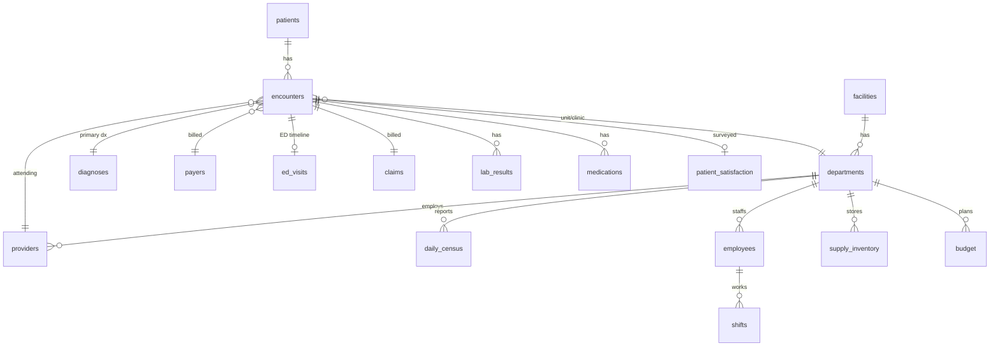

# Bluestone Health System — Course Datasets

> **Everything here is synthetic.** Bluestone Health System, its hospitals, towns, staff, and patients are fictional.
> Names were randomly combined from common-name lists; phone numbers use the fictional 555 area code; emails use the
> reserved `example.com` domain. ICD-10-CM diagnosis codes are real public codes used only for realism. Nothing here is
> clinical guidance.

These CSV files are generated by [`tools/generate_data.py`](../tools/generate_data.py) with a fixed random seed, so they are
identical every time they are regenerated. Each lesson's workbook embeds the slice of this data it needs, so you normally
work from the lesson's `.xlsx` file. The full CSVs are here for exploration, Power Query practice, and your own projects.

**Coverage:** January 1, 2024 – December 31, 2025. **"As of" date for age, aging, and status calculations: December 31, 2025.**

## The health system

| FacilityID | Facility | Type | Licensed beds |
|---|---|---|---|
| F01 | Bluestone Memorial Hospital | Tertiary Acute Care | 300 |
| F02 | Ashby Falls Community Hospital | Community Hospital | 60 |
| F03 | Cedar Ridge Medical Center | Acute Care | 90 |
| F04 | Bluestone Outpatient Pavilion | Ambulatory Care Center | 0 |

## How the tables relate



## Files

| File | Rows | Description |
|---|---:|---|
| [`facilities.csv`](facilities.csv) | 4 | Hospitals and outpatient sites in the Bluestone Health System. |
| [`departments.csv`](departments.csv) | 31 | Clinical and support departments (cost centers). Inpatient units have staffed beds. |
| [`providers.csv`](providers.csv) | 147 | Physicians and advanced practice providers. |
| [`payers.csv`](payers.csv) | 8 | Insurance payers and contract terms. |
| [`diagnoses.csv`](diagnoses.csv) | 51 | ICD-10-CM diagnosis lookup table (real public codes; descriptions shortened in places). |
| [`patients.csv`](patients.csv) | 4,000 | Registered patients. Ages are realistic; names, contact details, and MRNs are fictional. |
| [`encounters.csv`](encounters.csv) | 21,857 | One row per patient encounter (visit or stay), Jan 2024 – Dec 2025. A representative extract, not every visit. |
| [`ed_visits.csv`](ed_visits.csv) | 12,292 | Emergency department timeline for every ED arrival (treat-and-release and admitted). |
| [`claims.csv`](claims.csv) | 21,857 | One claim per encounter with payment status as of 12/31/2025. |
| [`lab_results.csv`](lab_results.csv) | 51,527 | Laboratory results with reference ranges and turnaround timestamps. |
| [`medications.csv`](medications.csv) | 25,834 | Pharmacy medication orders and doses dispensed. |
| [`patient_satisfaction.csv`](patient_satisfaction.csv) | 1,823 | Post-discharge patient experience surveys (HCAHPS-style, inpatient & observation). |
| [`daily_census.csv`](daily_census.csv) | 13,158 | Midnight census, admissions and discharges per inpatient unit per day (unit operations data — covers all patients, not just the encounter extract). |
| [`employees.csv`](employees.csv) | 554 | Nursing and clinical support staff at Bluestone Memorial Hospital (F01). |
| [`shifts.csv`](shifts.csv) | 19,176 | Scheduled and worked shifts, Q4 2025 (Oct 1 – Dec 31), Bluestone Memorial staff. |
| [`supply_inventory.csv`](supply_inventory.csv) | 257 | Supply stock by storage location (snapshot 12/31/2025). One row per SKU per location. |
| [`budget.csv`](budget.csv) | 5,928 | Monthly budget vs. actual by department and category, 2024–2025 (fiscal year = calendar year). |
| [`messy/patient_registrations_raw.csv`](messy/patient_registrations_raw.csv) | 650 | A deliberately messy registration export (inconsistent names, dates stored as text, duplicates) for the data-cleaning lessons. |

## Data dictionary

### `facilities.csv`

Hospitals and outpatient sites in the Bluestone Health System.

| Column | Description |
|---|---|
| `FacilityID` | Primary key (F01–F04). |
| `FacilityName` | Facility name. |
| `City` | City. |
| `State` | State. |
| `FacilityType` | Tertiary, community, acute, or ambulatory. |
| `LicensedBeds` | State-licensed bed count (0 for ambulatory). |
| `OpenedYear` | Year the facility opened. |

### `departments.csv`

Clinical and support departments (cost centers). Inpatient units have staffed beds.

| Column | Description |
|---|---|
| `DeptID` | Primary key. |
| `DeptName` | Department / unit name (names repeat across facilities, e.g. 'Emergency Department'). |
| `FacilityID` | FK → facilities. |
| `ServiceLine` | Clinical service line. |
| `UnitType` | Emergency, Inpatient, Critical Care, Observation, Outpatient, Ancillary. |
| `StaffedBeds` | Staffed beds (inpatient units only). |
| `CostCenter` | Four-digit finance cost center. |

### `providers.csv`

Physicians and advanced practice providers.

| Column | Description |
|---|---|
| `ProviderID` | Primary key. |
| `FirstName` | First name. |
| `LastName` | Last name. |
| `Credential` | MD, DO, NP, PA, or CNM. |
| `Specialty` | Clinical specialty. |
| `PrimaryDeptID` | FK → departments. |
| `FacilityID` | FK → facilities. |
| `HireDate` | Date hired. |
| `FTE` | Full-time equivalent (1.0 = full time). |

### `payers.csv`

Insurance payers and contract terms.

| Column | Description |
|---|---|
| `PayerID` | Primary key. |
| `PayerName` | Payer name. |
| `PayerType` | Government, Medicare Advantage, Commercial, Self-Pay, Workers' Comp. |
| `AvgAllowedPctOfCharges` | Average allowed amount as a share of billed charges. |
| `AvgDaysToPay` | Typical days from claim submission to payment. |
| `TimelyFilingDays` | Days after service a claim must be filed (0 = not applicable). |

### `diagnoses.csv`

ICD-10-CM diagnosis lookup table (real public codes; descriptions shortened in places).

| Column | Description |
|---|---|
| `DxCode` | ICD-10-CM code (primary key). |
| `DxDescription` | Description. |
| `DxCategory` | Body-system category. |
| `ChronicCondition` | Y if typically chronic. |
| `ExpectedLOS` | Benchmark inpatient length of stay in days (synthetic, for O/E analysis). |

### `patients.csv`

Registered patients. Ages are realistic; names, contact details, and MRNs are fictional.

| Column | Description |
|---|---|
| `PatientID` | Primary key. |
| `MRN` | Medical record number — 8 digits stored as TEXT (leading zeros matter!). |
| `FirstName` | First name. |
| `LastName` | Last name. |
| `Sex` | F or M. |
| `DOB` | Date of birth. |
| `City` | City. |
| `State` | State. |
| `ZIP` | ZIP code (text). |
| `Phone` | Fictional phone number (555 area code). |
| `Email` | Email (example.com) — blank if none on file. |
| `PreferredLanguage` | Preferred language. |
| `PrimaryPayerID` | FK → payers. |
| `PCPProviderID` | FK → providers (blank = no PCP). |
| `HeightIn` | Height in inches. |
| `WeightLb` | Weight in pounds. |
| `ChronicConditions` | Semicolon-separated chronic condition flags (HTN;DM;HF;COPD;AFIB;CKD;ASTHMA;CANCER;PSYCH;ETOH;OA;SEIZURE). |
| `RegistrationDate` | Date first registered. |
| `DeceasedDate` | Date of death if the patient died in a Bluestone facility. |

### `encounters.csv`

One row per patient encounter (visit or stay), Jan 2024 – Dec 2025. A representative extract, not every visit.

| Column | Description |
|---|---|
| `EncounterID` | Primary key. |
| `PatientID` | FK → patients. |
| `EncounterType` | Inpatient, Observation, Emergency, Outpatient. |
| `FacilityID` | FK → facilities. |
| `DeptID` | FK → departments (unit or clinic). |
| `AttendingProviderID` | FK → providers. |
| `AdmitSource` | Emergency Department, Direct Admit, Elective, Transfer (blank for ED/outpatient). |
| `AdmitDateTime` | Start of encounter (for ED-admitted patients: time the admit decision was made). |
| `DischargeDateTime` | End of encounter. |
| `PrimaryDxCode` | FK → diagnoses. |
| `DischargeDisposition` | Where the patient went. |
| `PayerID` | FK → payers (payer billed for this encounter). |
| `TotalCharges` | Gross billed charges ($). |
| `Readmit30` | Inpatient only: Y if the patient had another inpatient admission within 30 days after this discharge (0 ≤ days ≤ 30, by date). |

### `ed_visits.csv`

Emergency department timeline for every ED arrival (treat-and-release and admitted).

| Column | Description |
|---|---|
| `EDVisitID` | Primary key. |
| `EncounterID` | FK → encounters (the ED or resulting inpatient/observation encounter). |
| `PatientID` | FK → patients. |
| `FacilityID` | FK → facilities. |
| `ArrivalDateTime` | Door time. |
| `TriageDateTime` | Triage time. |
| `ProviderSeenDateTime` | First provider contact (blank = left without being seen). |
| `DispositionDateTime` | Decision time (discharge/admit). |
| `DepartureDateTime` | Left the ED. |
| `ArrivalMode` | Walk-In, Ambulance, Police, Air Transport. |
| `ESILevel` | Emergency Severity Index 1 (most urgent) – 5. |
| `ChiefComplaint` | Reason for visit. |
| `EDDisposition` | Discharged, Admitted, Observation, Transferred, LWBS, Left AMA, Expired. |
| `TempF` | Triage temperature °F. |
| `HeartRate` | Beats/min. |
| `RespRate` | Breaths/min. |
| `SystolicBP` | mmHg. |
| `DiastolicBP` | mmHg. |
| `SpO2` | Oxygen saturation %. |
| `PainScore` | 0–10. |

### `claims.csv`

One claim per encounter with payment status as of 12/31/2025.

| Column | Description |
|---|---|
| `ClaimID` | Primary key. |
| `EncounterID` | FK → encounters. |
| `PatientID` | FK → patients. |
| `PayerID` | FK → payers. |
| `ServiceDate` | Discharge/service date. |
| `SubmitDate` | Date the claim was submitted. |
| `BilledAmount` | Gross charges billed ($). |
| `AllowedAmount` | Contracted allowed amount (0 if denied). |
| `PatientResponsibility` | Copay/coinsurance/deductible owed by patient. |
| `PaidAmount` | Amount received to date. |
| `ClaimStatus` | Paid, Partially Paid, Denied, Appealed, Pending. |
| `DenialReason` | Reason for denial or partial payment. |
| `PaidDate` | Date payment received (blank if unpaid). |

### `lab_results.csv`

Laboratory results with reference ranges and turnaround timestamps.

| Column | Description |
|---|---|
| `LabResultID` | Primary key. |
| `EncounterID` | FK → encounters. |
| `PatientID` | FK → patients. |
| `TestCode` | Short test code. |
| `TestName` | Test name. |
| `ResultValue` | Numeric result. |
| `Units` | Units. |
| `RefLow` | Reference range low. |
| `RefHigh` | Reference range high. |
| `AbnormalFlag` | N normal, L/H low/high, LL/HH critical. |
| `Priority` | STAT or Routine. |
| `OrderDateTime` | Ordered. |
| `CollectedDateTime` | Specimen collected. |
| `ResultedDateTime` | Result available. |

### `medications.csv`

Pharmacy medication orders and doses dispensed.

| Column | Description |
|---|---|
| `MedOrderID` | Primary key. |
| `EncounterID` | FK → encounters. |
| `PatientID` | FK → patients. |
| `OrderDateTime` | Order time. |
| `MedicationName` | Generic drug name. |
| `DrugClass` | Therapeutic class. |
| `Dose` | Dose (text). |
| `Route` | IV, PO, SubQ, IM, Inhaled. |
| `Frequency` | Dosing frequency. |
| `DosesDispensed` | Number of doses dispensed. |
| `UnitCost` | Acquisition cost per dose ($). |
| `HighAlert` | Y for high-alert medications (insulin, opioids, anticoagulants, chemo…). |
| `OrderingProviderID` | FK → providers. |

### `patient_satisfaction.csv`

Post-discharge patient experience surveys (HCAHPS-style, inpatient & observation).

| Column | Description |
|---|---|
| `SurveyID` | Primary key. |
| `EncounterID` | FK → encounters. |
| `FacilityID` | FK → facilities. |
| `DeptID` | FK → departments. |
| `DischargeDate` | Discharge date. |
| `SurveyReceivedDate` | Date returned. |
| `NurseCommunication` | 1 Never, 2 Sometimes, 3 Usually, 4 Always. |
| `DoctorCommunication` | 1–4 scale. |
| `StaffResponsiveness` | 1–4 scale. |
| `Cleanliness` | 1–4 scale. |
| `Quietness` | 1–4 scale. |
| `MedicationExplained` | 1–4 scale. |
| `DischargeInfoProvided` | Yes/No. |
| `OverallRating` | 0 (worst) – 10 (best). |
| `WouldRecommend` | Definitely Yes, Probably Yes, Probably No, Definitely No. |
| `Comment` | Free-text comment (blank if none). |

### `daily_census.csv`

Midnight census, admissions and discharges per inpatient unit per day (unit operations data — covers all patients, not just the encounter extract).

| Column | Description |
|---|---|
| `CensusDate` | Date. |
| `FacilityID` | FK → facilities. |
| `DeptID` | FK → departments. |
| `StaffedBeds` | Staffed beds that day. |
| `Admissions` | Admissions + transfers in. |
| `Discharges` | Discharges + transfers out. |
| `MidnightCensus` | Patients in beds at midnight (can exceed staffed beds on surge days). |

### `employees.csv`

Nursing and clinical support staff at Bluestone Memorial Hospital (F01).

| Column | Description |
|---|---|
| `EmployeeID` | Primary key. |
| `FirstName` | First name. |
| `LastName` | Last name. |
| `JobTitle` | Role. |
| `DeptID` | FK → departments. |
| `FacilityID` | FK → facilities. |
| `EmploymentType` | Full-Time, Part-Time, Per Diem, Agency. |
| `FTE` | FTE (0 = per diem). |
| `HourlyRate` | Base hourly rate ($). |
| `HireDate` | Hire date. |
| `TermDate` | Termination date (blank if employed). |
| `Status` | Active, Terminated, Leave of Absence. |
| `ShiftPreference` | Day, Night, Rotating. |
| `Certifications` | Semicolon-separated certifications. |

### `shifts.csv`

Scheduled and worked shifts, Q4 2025 (Oct 1 – Dec 31), Bluestone Memorial staff.

| Column | Description |
|---|---|
| `ShiftID` | Primary key. |
| `EmployeeID` | FK → employees. |
| `DeptID` | FK → departments. |
| `ShiftDate` | Date the shift starts. |
| `ShiftType` | Day 12h (07:00–19:30), Night 12h (19:00–07:30), Day 8h (07:00–15:30), Evening 8h (15:00–23:30). |
| `ScheduledStart` | Scheduled start. |
| `ScheduledEnd` | Scheduled end (night shifts end the next day). |
| `ScheduledHours` | Paid hours scheduled (span minus 30-min unpaid meal). |
| `ClockIn` | Actual clock-in (blank if not worked). |
| `ClockOut` | Actual clock-out. |
| `WorkedHours` | Paid hours worked = (ClockOut − ClockIn) − 0.5 h meal. |
| `HoursOverSchedule` | WorkedHours − ScheduledHours, floored at 0. |
| `ShiftStatus` | Worked, Called Off, No Show. |

### `supply_inventory.csv`

Supply stock by storage location (snapshot 12/31/2025). One row per SKU per location.

| Column | Description |
|---|---|
| `StockID` | Primary key (SKU + location). |
| `SKU` | Item number (repeats across locations). |
| `ItemDescription` | Description. |
| `Category` | Supply category. |
| `Vendor` | Supplier. |
| `UnitOfMeasure` | Each, Box, Case, Pack… |
| `UnitCost` | Cost per unit of measure ($). |
| `LocationDeptID` | FK → departments (storeroom location). |
| `QtyOnHand` | Units on hand. |
| `ParLevel` | Target stock level. |
| `ReorderPoint` | Reorder when QtyOnHand ≤ this. |
| `ReorderQty` | Standard reorder quantity. |
| `LeadTimeDays` | Vendor lead time. |
| `LastCountDate` | Last physical count. |
| `ExpirationDate` | Earliest lot expiration (perishables only). |
| `LotNumber` | Lot number (perishables only). |

### `budget.csv`

Monthly budget vs. actual by department and category, 2024–2025 (fiscal year = calendar year).

| Column | Description |
|---|---|
| `MonthStart` | First day of month. |
| `FiscalYear` | Year. |
| `FiscalMonth` | 1–12. |
| `FacilityID` | FK → facilities. |
| `DeptID` | FK → departments. |
| `CostCenter` | Cost center. |
| `LineType` | Revenue or Expense. |
| `Category` | Revenue or expense category. |
| `BudgetAmount` | Budget ($). |
| `ActualAmount` | Actual ($). |

## Regenerating

```bash
python tools/generate_data.py
```
